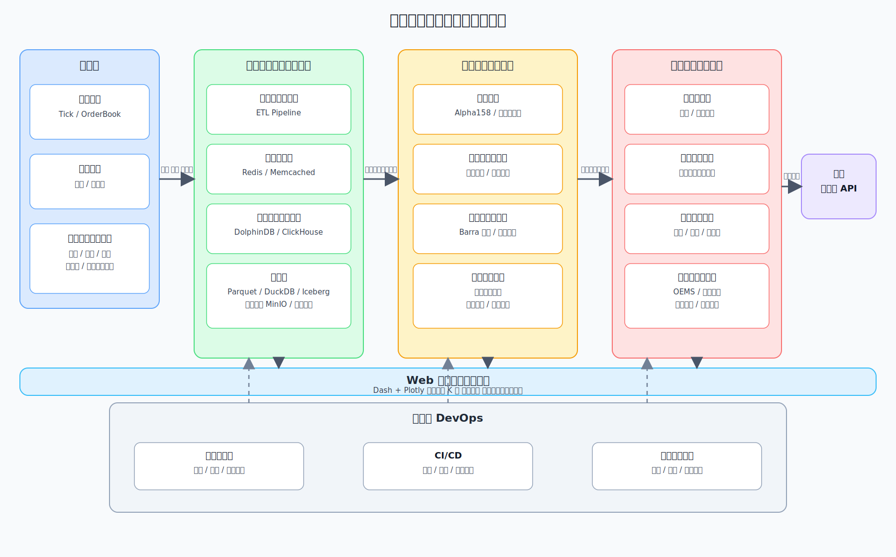

# 工业级量化交易系统总体设计

## 1. 文档目标

本文档用于定义 `stock_analysis_by_gpt` 的中长期演进蓝图，将当前以港股数据获取与分析为主的原型工程，逐步扩展为一套可支持研究、回测、信号生产与交易执行的工业级量化交易系统。

本文档重点回答四个问题：

1. 系统应该分成哪些层。
2. 每一层的核心职责与技术选型是什么。
3. 当前仓库距离目标架构还缺什么。
4. 下一阶段应该先做哪些事，优先级如何排。

## 2. 设计原则

- 分层解耦：数据、投研、执行、监控分层建设，接口清晰。
- 存算分离：原始数据、特征数据、模型产物、交易状态分层存储。
- 流批一体：历史回测与盘中计算尽量复用同一套表达与口径。
- 可回放：任何信号、持仓、订单和风控决策都应可追踪、可复现。
- 可扩展：先支持单机，再平滑扩展到分布式。
- 工程化优先：从一开始就考虑测试、监控、发布和风险控制。

## 3. 总体架构

可编辑的 draw.io 源文件见 [QUANT_SYSTEM_OVERALL_DESIGN.drawio](/home/ccs/code/stock_analysis_by_gpt/QUANT_SYSTEM_OVERALL_DESIGN.drawio)。

SVG 版本如下：



## 4. 分层设计

### 4.1 数据与计算基础设施层

职责：

- 接入历史行情、实时行情、财务数据、公告和另类数据。
- 统一做清洗、对齐、去重、复权和交易日历处理。
- 提供统一的数据访问接口，供研究、回测、实盘共用。

推荐技术栈：

- 单机/小团队：`Parquet + DuckDB`
- 缓存/实时信号总线：`Redis`
- 分布式时序计算：`DolphinDB` 或 `ClickHouse`
- 数据湖演进：`Parquet + Iceberg`，对象存储可接 `MinIO`

落地建议：

- 当前仓库已经有 `DuckDB` 基础，可继续作为第一阶段主存储。
- 历史数据建议从单表存储逐步演进到分层数据集：
  - `raw`：原始抓取结果
  - `clean`：清洗后标准 OHLCV
  - `feature`：因子和特征
  - `signal`：策略信号
  - `trade`：订单、成交、持仓

### 4.2 投研与因子工厂层

职责：

- 统一特征工程和因子表达。
- 提供批量因子计算、IC 检验、分层回测、稳定性分析。
- 支持传统因子与 AI/深度学习因子共存。

推荐技术栈：

- 因子研究：`Qlib`
- 传统因子分析：可参考 `RQFactor` 的工作流设计
- 强化学习实验：`FinRL-X`
- 高性能表达式编译：`KunQuant`
- 树模型因子挖掘：`LightGBM`
- 深度时序建模：时序 `Transformer`
- 符号因子发现：`gplearn`

落地建议：

- 在仓库内先建立因子表达与计算接口，再考虑完整引入 Qlib。
- 因子层至少要支持：
  - 横截面因子
  - 时序因子
  - 多周期重采样
  - 行业/市值中性化
  - IC / RankIC / 分组收益 / 因子衰减分析

建议把因子挖掘拆成三条并行路线：

- 规则与表达式路线：
  - 基于量价、基本面、事件数据构建可解释因子
  - 适合做研究基线、稳定复现和人工筛选
- 机器学习路线：
  - 用 `LightGBM` 做截面收益预测、特征重要性排序和非线性组合
  - 适合处理中等规模结构化特征，训练效率高，解释性也相对较好
- 深度时序路线：
  - 用时序 `Transformer` 处理多资产、多步长、多特征的序列建模
  - 适合捕捉长依赖、状态切换和复杂时序结构
- 符号回归路线：
  - 用 `gplearn` 做表达式搜索和自动特征构造
  - 适合从底层算子中自动挖掘可解释的因子公式

建议的模型定位：

| 路线 | 推荐工具 | 适用场景 | 优点 | 风险 |
| :--- | :--- | :--- | :--- | :--- |
| 传统因子 | 表达式引擎 / Qlib | 基础 alpha 库、研究基线 | 可解释、稳定 | 非线性能力有限 |
| GBDT | LightGBM | 截面选股、特征筛选、收益预测 | 训练快、对表格数据友好 | 时序建模能力有限 |
| 深度时序 | Time Series Transformer | 多步预测、序列信号挖掘 | 能建模复杂时序关系 | 训练成本高、调参复杂 |
| 符号回归 | gplearn | 自动表达式搜索、可解释因子发现 | 因子公式直观 | 容易过拟合、搜索成本高 |

建议的工程落地方式：

- `LightGBM`：
  - 用于横截面标签学习和特征重要性分析
  - 输出可作为因子打分器或组合层输入
- 时序 `Transformer`：
  - 用于分钟级或日频序列预测
  - 输出可作为未来收益预测、 regime 信号或辅助因子
- `gplearn`：
  - 用于自动生成候选公式
  - 生成的表达式需要进入统一验证流水线做 IC、稳定性、换手率和样本外检验

建议的 `factor_engine` 子架构：

```text
factor_engine/
├── registry.py                # 因子注册表
├── base.py                    # 因子基类与统一接口
├── context.py                 # 计算上下文、市场配置、时间窗口
├── expressions/               # 规则与表达式因子
│   ├── operators.py           # 算子库: ts_mean, rank, delay, corr...
│   ├── alpha_factors.py       # 经典 alpha 因子
│   └── parser.py              # 表达式解析与执行
├── ml/
│   ├── features.py            # 机器学习特征拼装
│   ├── labels.py              # 收益标签、分类标签
│   ├── lightgbm_pipeline.py   # LightGBM 训练和推理
│   └── feature_selection.py   # 特征筛选与重要性分析
├── deep/
│   ├── datasets.py            # 时序样本构造
│   ├── transformer.py         # 时序 Transformer 模型
│   ├── trainer.py             # 训练、验证、早停
│   └── inference.py           # 批量推理与因子输出
├── symbolic/
│   ├── function_set.py        # gplearn 函数集
│   ├── search.py              # 表达式搜索
│   └── export.py              # 候选公式导出
├── postprocess/
│   ├── neutralize.py          # 行业/市值中性化
│   ├── standardize.py         # 标准化和去极值
│   └── combine.py             # 因子合成与加权
└── cache/
    └── storage.py             # 中间结果缓存
```

统一接口建议：

- `fit(train_frame, valid_frame=None, config=None)`：
  - 用于 `LightGBM`、`Transformer`、`gplearn` 这类需要训练的因子生成器
- `transform(frame, context=None)`：
  - 将输入数据转成单因子或多因子输出
- `fit_transform(train_frame, valid_frame=None, config=None)`：
  - 训练并输出训练期因子结果
- `predict(frame, context=None)`：
  - 输出样本外打分、未来收益预测或组合排序分数
- `metadata()`：
  - 返回因子名、依赖字段、参数、训练窗口、版本号

数据流建议：

1. `data_store` 提供标准化行情和特征底表。
2. `factor_engine.expressions` 计算基础规则因子。
3. `factor_engine.ml` 将基础因子和原始特征拼成训练集，供 `LightGBM` 学习。
4. `factor_engine.deep` 将多资产时序窗口拼成序列样本，供 `Transformer` 学习。
5. `factor_engine.symbolic` 从基础算子和原始特征出发，用 `gplearn` 搜索新表达式。
6. 所有产出统一进入 `postprocess` 做标准化、中性化、合成。
7. 最终因子送入 `factor_validation` 和 `backtest_engine`。

训练与验证规范建议：

- 时间切分优先，不使用随机切分。
- 至少区分训练集、验证集、测试集、样本外区间。
- 所有模型都记录：
  - 数据版本
  - 特征版本
  - 标签定义
  - 训练时间区间
  - 参数配置
  - 模型产物路径
- 所有候选因子都经过统一验证：
  - IC / RankIC
  - 分组收益
  - 换手率
  - 稳定性
  - 样本外表现
  - 交易成本敏感性

各路线的职责边界建议：

- 表达式因子：
  - 负责可解释、低成本、稳定的基线因子库
- `LightGBM`：
  - 负责结构化特征融合、非线性打分和特征重要性分析
- 时序 `Transformer`：
  - 负责处理长序列、多特征、多步预测和时序状态抽取
- `gplearn`：
  - 负责自动发现新表达式，但不能绕过统一验证和样本外检验

Web 展示层对接建议：

- K 线页读取 `data_store` 的标准 OHLCV 数据。
- 因子页读取 `factor_engine` 输出的单因子和多因子结果。
- 回测页读取 `backtest_engine` 的净值、回撤、持仓和成交结果。
- 模型页展示：
  - `LightGBM` 特征重要性
  - `Transformer` 训练曲线和预测结果
  - `gplearn` 候选表达式及评分

### 4.3 策略执行与交易层

职责：

- 将研究信号转化为组合权重和真实订单。
- 提供回测撮合、模拟盘、实盘接入三种运行模式。
- 对接券商柜台和交易所 API，并内置风控。

推荐技术栈：

- 事件驱动策略框架：`VeighNa`
- 高性能回测/执行内核：可参考 `nanoback` 思路
- 国内接口方向：`CTP / XTP / 易盛`

落地建议：

- 先做事件驱动回测，再做纸面交易，再接模拟盘，最后接实盘。
- OMS/OEMS 需要至少记录：
  - 订单状态
  - 持仓快照
  - 资金曲线
  - 风控拦截日志

### 4.4 监控与 DevOps 层

职责：

- 监控数据延迟、任务失败率、策略收益波动、订单异常。
- 提供自动测试、自动发布、自动回滚。
- 建立模型与策略变更的审计链路。

推荐建设内容：

- 单元测试、集成测试、回测基准测试
- 任务编排与告警
- 运行日志与关键指标可视化
- 模型版本、参数版本、数据版本绑定

### 4.5 Web 展示与交互层

职责：

- 提供统一的浏览器端研究工作台，承接 K 线、因子、组合和回测结果展示。
- 支持研究人员通过交互控件动态切换股票、时间区间、因子、调仓频率和回测参数。
- 将数据层、因子层、回测层的结果转成可视化页面，降低分析和复盘成本。

推荐技术栈：

- 主推荐：`Dash + Plotly`
- 快速原型备选：`Streamlit`

推荐理由：

- `Dash` 官方文档将其定位为用于构建分析型应用的 Python 框架，适合做多页面、带状态和回调的内部量化工作台。
- `Dash` 的回调机制适合做动态筛选、参数联动和回测结果重算。
- `Plotly` 官方提供原生 `Candlestick` 图形，适合直接承接 OHLCV 数据绘制交互式 K 线。
- `Streamlit` 上手更快，适合临时验证想法，但在复杂页面编排、回调关系和长期工程化方面通常不如 `Dash` 稳定。

建议展示能力：

- K 线总览页：
  - 代码切换
  - 时间区间切换
  - 均线、成交量、技术指标叠加
- 因子分析页：
  - 单因子时序
  - 横截面分布
  - IC / RankIC 曲线
  - 分组收益和衰减分析
- 组合回测页：
  - 收益曲线
  - 回撤曲线
  - 超额收益
  - 调仓记录
  - 持仓分布
- 策略诊断页：
  - 参数面板
  - 回测日志
  - 风险暴露
  - 绩效归因

建议实现方式：

- 用 `Plotly` 绘制 K 线、净值曲线、回撤曲线、分层收益图和热力图。
- 用 `Dash` 组织页面、筛选控件、回调逻辑和状态同步。
- 回测与因子计算仍放在 Python 后端，不把业务逻辑塞进前端。
- 先做内部研究看板，再逐步补权限、缓存、异步任务和报告导出。

## 5. 参考行业实践

### 5.1 头部私募经验

- 鸣石、多核平台思路：强调因子工厂化、模块化、多策略协同。
- 海浦等万级因子库思路：强调统一表达式体系、自动筛选、批量验证。
- 国内高频/低延迟团队：强调流批一体、柜台速度、硬件网络优化。

### 5.2 开源框架经验

- `Qlib`：适合搭建 AI 驱动的研究流水线。
- `DolphinDB`：适合统一历史计算与实时流计算。
- `FinRL-X`：适合做 AI 原生的策略实验框架。
- `VeighNa`：适合把研究结果接到事件驱动执行与交易接口。
- `Dash + Plotly`：适合把 K 线、因子研究与回测结果做成交互式浏览器工作台。
- `LightGBM`：适合做结构化因子的非线性建模和特征重要性排序。
- 时序 `Transformer`：适合做多特征时间序列预测与复杂序列表示学习。
- `gplearn`：适合做符号回归和可解释公式挖掘。

## 6. 当前仓库现状映射

结合当前 `stock_analysis_by_gpt` 仓库，已有能力大致如下：

- 数据抓取：
  - `data_fetcher.py`
  - 已支持港股历史数据多源回退
- 数据存储：
  - `db_manager.py`
  - 以 `DuckDB` 为核心
- 指标/分析：
  - `indicators.py`
  - `stock_analyzer.py`
  - `analyzer_core.py`
- 回测与策略雏形：
  - `backtest.py`
  - `strategy/`
- 报告与展示：
  - `reporting.py`
  - `chart_plotter.py`

这说明仓库已经具备“数据原型 + 分析原型 + 策略雏形”的基础，但距离工业级系统仍缺少以下关键能力：

- 标准化数据分层
- 统一因子工厂接口
- 批量研究任务编排
- 事件驱动回测内核
- 面向投研的 Web 展示工作台
- 订单管理与执行状态机
- 风控体系
- 监控与 CI/CD

## 7. 目标系统模块拆分

建议后续按下面的逻辑拆模块：

| 层级 | 建议模块 | 说明 |
| :--- | :--- | :--- |
| 数据层 | `data_ingest/` | 行情、财务、公告、另类数据接入 |
| 数据层 | `data_model/` | 标准 schema、交易日历、复权、企业行为 |
| 数据层 | `data_store/` | DuckDB/Parquet/Redis 抽象 |
| 因子层 | `factor_engine/` | 表达式引擎、因子注册、依赖计算 |
| 因子层 | `factor_validation/` | IC、分组、回撤、稳定性分析 |
| 研究层 | `research/` | Notebook、实验、模型训练任务 |
| 展示层 | `web_app/` | Dash 页面、Plotly 图表、交互回调 |
| 回测层 | `backtest_engine/` | 事件驱动撮合、费用、滑点、持仓管理 |
| 交易层 | `execution/` | 订单、拆单、经纪商网关 |
| 风控层 | `risk/` | 仓位、行业、单票、成交、熔断规则 |
| 运维层 | `ops/` | 监控、调度、发布、审计 |

## 8. 分阶段实施路线

### Phase 1：夯实单机数据与研究底座

目标：把当前项目打造成稳定的单机研究平台。

关键结果：

- 统一数据 schema
- 支持日频/分钟频数据入湖
- 提供标准因子计算接口
- 能跑基础单因子回测
- 能展示基础 K 线和策略结果页面原型

### Phase 2：建立因子工厂与回测平台

目标：支持多因子批量验证和组合回测。

关键结果：

- 因子注册表
- 因子批计算流水线
- IC/分组回测/组合优化
- 事件驱动回测内核
- 可交互的 K 线、因子与组合回测工作台

### Phase 3：建立模拟交易闭环

目标：把研究信号推进到仿真执行。

关键结果：

- 信号转订单
- 订单生命周期管理
- 模拟撮合
- 风控规则与异常拦截

### Phase 4：接入实时与实盘

目标：接入实时行情、模拟柜台和真实交易接口。

关键结果：

- 流式行情接入
- 盘中增量因子计算
- 券商 API 网关
- 全链路监控与审计

## 9. TODO 与优先级

优先级说明：

- `P0`：必须先做，没有它后面容易返工。
- `P1`：核心能力，完成后系统才真正可用。
- `P2`：增强能力，提升效率和规模化水平。
- `P3`：生产优化项，偏高阶能力。

| 优先级 | TODO | 目标产出 |
| :--- | :--- | :--- |
| `P0` | 定义统一市场数据 schema（OHLCV、交易日历、复权、代码标准） | 明确 `raw/clean/feature/signal/trade` 数据结构 |
| `P0` | 将历史数据存储从单表扩展到 `Parquet + DuckDB` 分层落盘 | 可复用的数据湖雏形 |
| `P0` | 建立数据接入抽象层，统一港股/A股/指数/ETF 数据接口 | `DataSource`/`DataLoader` 抽象 |
| `P0` | 为现有抓取和数据库模块补齐单元测试与集成测试 | 可回归验证的数据基础设施 |
| `P1` | 搭建因子引擎接口，支持注册、计算、缓存和依赖解析 | `factor_engine/` 初版 |
| `P1` | 实现基础因子库：动量、反转、波动率、量价、估值 | 最小可用因子集合 |
| `P1` | 建立因子验证流水线：IC、RankIC、分组收益、换手率、衰减分析 | 因子评估报告 |
| `P1` | 建立机器学习因子挖掘流水线 | 支持 `LightGBM` 训练、验证和特征重要性输出 |
| `P1` | 建立符号回归因子挖掘流水线 | 支持 `gplearn` 自动生成候选表达式 |
| `P1` | 重构回测模块为事件驱动引擎 | 支持滑点、手续费、持仓与成交 |
| `P1` | 建立组合层：等权、风险预算、简单约束优化 | 从因子到权重的闭环 |
| `P1` | 定义策略运行配置、实验记录与版本标识 | 可追踪实验系统 |
| `P1` | 建立 `Dash + Plotly` Web 工作台 | 浏览器内动态查看 K 线、因子和回测结果 |
| `P1` | 实现 K 线页、因子分析页、组合回测页 | 统一研究展示入口 |
| `P2` | 引入分钟级/实时数据接入与增量更新 | 盘中研究能力 |
| `P2` | 建立时序 `Transformer` 训练与推理流水线 | 支持多步收益预测和时序信号学习 |
| `P2` | 接入 Redis 做缓存与实时信号总线 | 更低延迟的数据与信号分发 |
| `P2` | 增加行业、市值、风格因子中性化与风险暴露分析 | 更贴近机构投研流程 |
| `P2` | 评估引入 Qlib 作为研究工作流组件 | 加速 AI 因子研究 |
| `P2` | 建立批量实验调度能力 | 多策略、多参数并行试验 |
| `P2` | 为 Web 看板补缓存、异步任务和导出能力 | 提升交互性能与可运维性 |
| `P3` | 建立模拟交易与订单状态机 | 从回测过渡到纸面交易 |
| `P3` | 接入 VeighNa 或券商 API 网关 | 实盘执行基础 |
| `P3` | 补齐风控中心：限仓、限撤、黑名单、异常熔断 | 交易安全边界 |
| `P3` | 建立监控、告警、审计与 CI/CD | 生产级运维能力 |

## 10. 推荐的近期落地顺序

如果从当前仓库直接往前推进，建议按这个顺序做：

1. 统一数据模型与目录结构。
2. 把 `DuckDB` 和 `Parquet` 组合起来，做好分层存储。
3. 抽象 `DataLoader`，让回测和研究不直接依赖抓取细节。
4. 建立 `factor_engine`，先跑一批基础因子。
5. 把 `backtest.py` 升级成事件驱动回测引擎。
6. 建立 `Dash + Plotly` Web 工作台，先打通 K 线和回测结果展示。
7. 增加组合优化、实验记录、报告生成。
8. 再考虑实时数据、模拟交易和实盘接入。

## 11. 建议的目录演进

```text
stock_analysis_by_gpt/
├── data_ingest/
├── data_model/
├── data_store/
├── factor_engine/
├── factor_validation/
├── research/
├── web_app/
├── backtest_engine/
├── execution/
├── risk/
├── ops/
├── strategy/
├── reports/
└── assets/
```

## 12. 总结

这套系统的核心，不是简单把“抓数据、算指标、回测、下单”拼在一起，而是要建立一条统一、可复现、可扩展的研究到执行流水线。

对当前项目而言，最现实的演进路径不是一口气冲向分布式和低延迟，而是先把单机版的数据层、因子层和回测层做扎实。等这三层稳定后，再引入实时计算、订单管理、风控和交易接口，系统自然就会从分析工具长成真正的量化平台。
