# 工业级量化交易系统总体设计

## 1. 文档目标

本文档定义 `stock_analysis_by_gpt` 的中长期演进蓝图，将当前以港股数据获取与分析为主的原型工程，逐步扩展为一套可支持研究、回测、信号生产与交易执行的工业级量化交易系统。

本文档回答四个问题：

1. 系统应该分成哪些层。
2. 每一层的核心职责与技术选型是什么。
3. 当前仓库距离目标架构还缺什么。
4. 下一阶段应该先做哪些事，优先级如何排。

## 2. 设计原则

- **分层解耦**：数据、投研、执行、监控分层建设，接口清晰。
- **存算分离**：原始数据、特征数据、模型产物、交易状态分层存储。
- **流批一体**：历史回测与盘中计算尽量复用同一套表达与口径。
- **可回放**：任何信号、持仓、订单和风控决策都应可追踪、可复现。
- **可扩展**：先支持单机，再平滑扩展到分布式。
- **工程化优先**：从一开始就考虑测试、监控、发布和风险控制。

## 3. 总体架构

可编辑的 draw.io 源文件见 [QUANT_SYSTEM_OVERALL_DESIGN.drawio](./QUANT_SYSTEM_OVERALL_DESIGN.drawio)。

SVG 版本：


核心数据流：

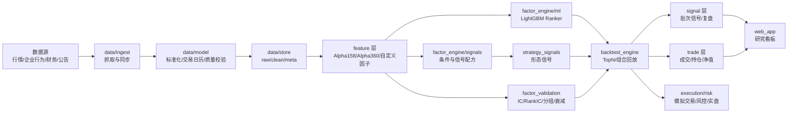

## 4. 分层设计

### 4.1 数据与计算基础设施层

**职责：**

- 接入历史行情、实时行情、财务数据、公告和另类数据。
- 统一做清洗、对齐、去重、复权和交易日历处理。
- 提供统一的数据访问接口，供研究、回测、实盘共用。

**推荐技术栈：**

| 场景 | 技术 |
|---|---|
| 单机/小团队主力存储 | `Parquet + DuckDB` |
| 缓存/实时信号总线 | `Redis` |
| 分布式时序计算 | `DolphinDB` 或 `ClickHouse` |
| 数据湖演进 | `Parquet + Iceberg`，对象存储可接 `MinIO` |

**分层数据集**（从单表逐步演进）：

- `raw`：原始抓取结果
- `clean`：清洗后标准 OHLCV
- `feature`：因子和特征
- `signal`：策略信号
- `trade`：订单、成交、持仓

**模块设计图：**

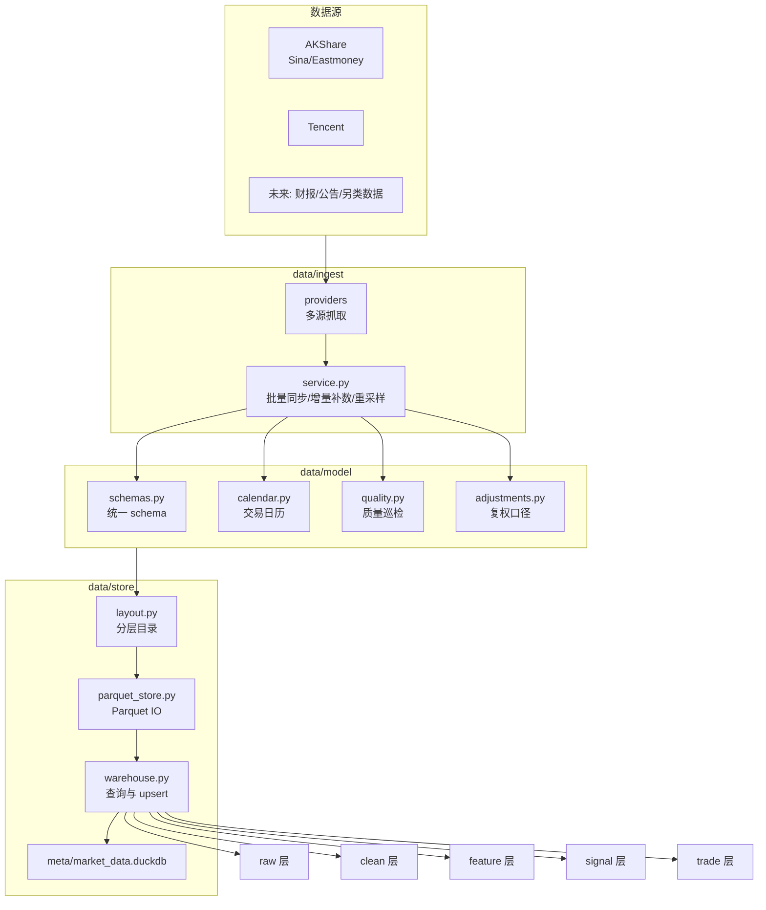

#### 4.1.1 当前数据层架构

当前数据层已形成可运行的单机版本，架构如下：

```text
数据源
├── AKShare (Sina / Eastmoney)
├── Tencent
└── 未来待接入: 财报 / 公告 / 另类数据
            |
            v
data/ingest/providers
├── hk_universe.py          # 港股股票池获取与过滤
├── hk_history.py           # 港股日线/分钟线多源抓取
├── hk_corporate_actions.py # 港股企业行为（分红/送股/供股）
├── hk_info.py              # 港股基础信息
├── cn_history.py           # A股历史行情
├── cn_info.py              # A股基础信息
└── history_utils.py        # 周期标准化、日期过滤、重试、重采样
            |
            v
data/ingest/service.py
├── 批量同步 / 多周期调度 / 增量补数
├── 1min -> 5min/60min 派生
├── 港股企业行为同步/回读
└── 缺口报表 / 运行摘要 / 质量摘要
            |
            v
data/model
├── schemas.py              # 统一 stock_code / market / exchange / OHLCV / stock_info schema
├── calendar.py             # 统一交易日历与盘中时段处理
├── quality.py              # OHLCV 质量巡检
└── adjustments.py          # 复权口径与企业行为 schema
            |
            v
data/store
├── layout.py               # raw/clean/feature/signal/trade/meta 目录布局
├── parquet_store.py        # Parquet 追加写 / 覆盖写 / 压实去重
├── warehouse.py            # clean/feature 层查询与元数据查询
└── database_manager.py     # legacy 兼容桥接
            |
            v
当前已落地存储
├── raw/ohlcv_snapshots          # 行情原始抓取快照
├── raw/corporate_actions_snapshots  # 企业行为原始抓取快照
├── clean/ohlcv                  # 主行情数据集，Parquet 分区存储
├── clean/corporate_actions      # 企业行为数据集
├── feature/features             # 特征层长表数据集
├── meta/market_data.duckdb      # 元数据、stock_info_registry
└── assets/reports/*.json        # 批量同步缺口报表

规划中尚未落地
├── feature/*       # 版本管理与缓存
├── signal/*        # 策略信号与评分持久化
└── trade/*         # 订单、成交、持仓
```

#### 4.1.2 数据部分已完成项

- 统一 `data/` 目录承接数据接入、标准化与存储逻辑
- `Parquet + DuckDB` 单机数据层组合
- `raw/clean/feature/signal/trade/meta` 目录布局
- 统一 OHLCV / stock info schema 与代码标准化
- 港股与 A 股历史行情接入
- 日线与分钟级 (`1min/5min/60min`) 多周期数据同步
- 多源回退抓取（AKShare Sina / Eastmoney / Tencent）
- 批量并发同步、增量补数、缺口报表输出
- `1min` 数据派生 `5min/60min`
- `raw` 层原始抓取快照持久化
- 统一交易日历，已接入港股分钟线过滤与重采样
- 基础 OHLCV 数据质量巡检
- 统一复权口径标准化与企业行为基础 schema
- 港股企业行为免费数据源初版（东方财富结构化源）
- `feature` 层读写接口初版（长表 schema + Parquet IO）
- `factor_engine/` 最小骨架，可计算并落库首批 Qlib 风格 `Alpha158/Alpha360` 因子

#### 4.1.3 数据部分当前缺失项

- **企业行为**：A 股企业行为、港股官方披露爬虫校验和本地复权回放仍未完成。
- **财务/公告/另类数据**：尚未接入。
- **feature 层**：缺少版本管理、缓存、横截面批处理和统一研究调度。
- **signal/trade 层**：已有基础 schema 和 Parquet 读写接口，仍缺订单状态机、持仓快照和完整 OMS 语义。
- **资产分类**：指数、ETF、杠反产品尚无独立数据模型。
- **数据质量**：已有基础巡检，仍缺停牌识别、节假日缺口识别、复权一致性校验和自动修复流水线。
- **legacy 清理**：`assets/stock_data.duckdb` 已从主链路移除，但迁移说明和清理脚本未系统化。

### 4.2 投研与因子工厂层

**职责：**

- 统一特征工程和因子表达。
- 提供批量因子计算、IC 检验、分层回测、稳定性分析。
- 将基础因子组合成可解释的形态信号、可训练的排序模型和可落地的组合输入。
- 支持传统因子与 AI/深度学习因子共存。

**模块设计图：**

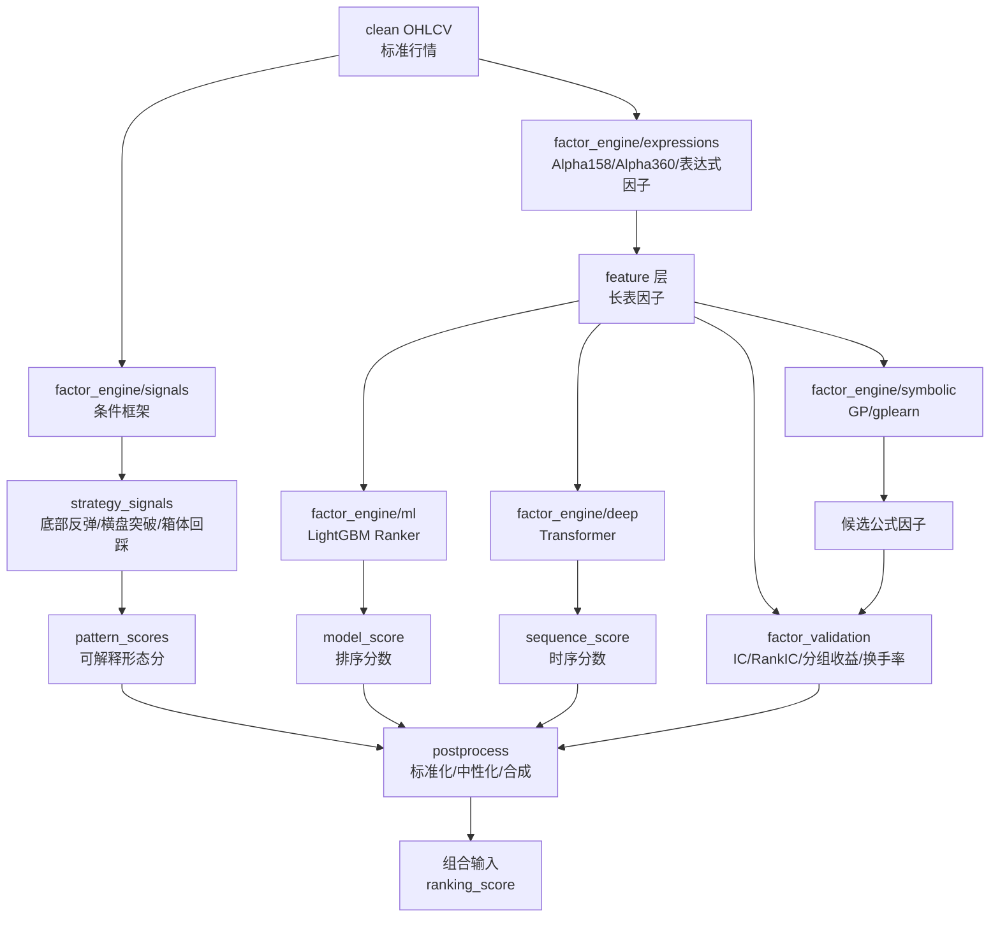

#### 4.2.1 因子、条件、信号配方、策略与组合的边界

量化系统需要明确区分五个层次：

```text
因子 Factor
  -> 条件 Condition
  -> 信号配方 Signal Recipe
  -> 策略 Strategy
  -> 组合 Portfolio
```

| 层次 | 定义 | 示例 |
|---|---|---|
| 因子 Factor | 单一可计算数值 | `MA20`, `STD20`, `RSV20`, `VMA20` |
| 条件 Condition | 因子的阈值/排序判断 | "20日波动率处于低位", "收盘价突破20日高点" |
| 信号配方 Signal Recipe | 多个条件的组合，输出一个可评分信号 | "底部反弹", "横盘突破", "箱体回踩" |
| 策略 Strategy | 信号之上定义持仓、止损止盈、调仓频率、交易成本和风控 | "顺势回踩策略（含 MA25 止损 + 移动止盈）" |
| 组合 Portfolio | 多只股票、多个策略之间的资金分配 | "TopN 等权 / 评分加权 / 风险预算" |

信号配方本质是人工可解释的"因子组合器"。每个配方使用基础因子+条件逻辑，输出一个评分，进入统一的 `signal` 层和 `factor_validation` / `backtest_engine` 检验。

**层次关系图：**

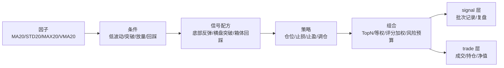

**因子到信号的表达示例：**

| 形态 | 因子零件 | 条件组合 | 输出 |
|---|---|---|---|
| 底部反弹 | `ROC20 / RSV20 / VMA20 / VOLUME` | 中期超跌 + 当日反转 + 放量确认 | `bottom_rebound_score` |
| 横盘突破 | `STD20 / MAX20 / MIN20 / CLOSE / VMA20` | 低波动压缩 + 突破区间高点 + 放量 | `range_breakout_score` |
| 箱体回踩 | `MAX60 / MIN60 / CLOSE / VOLUME / WVMA20` | 曾经突破 + 回踩不破 + 缩量 | `box_pullback_score` |

#### 4.2.2 信号配方层设计（`strategy_signals/`）

信号配方的框架基类放在 `factor_engine/signals/`，具体的命名形态配方形成独立目录 `strategy_signals/`。两者的关系是：**框架定义"怎样写一个信号配方"，目录存放"有哪些信号配方"**。

**模块设计图：**

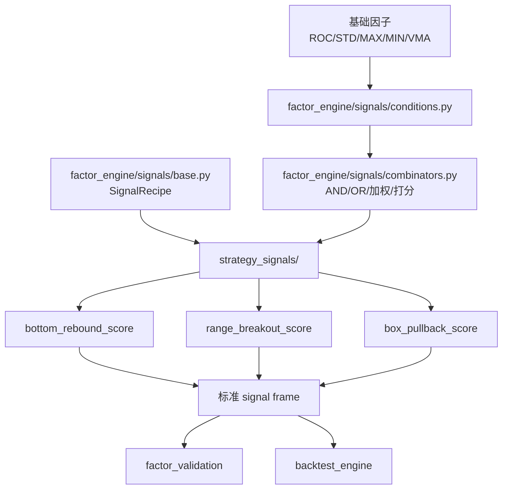

```text
factor_engine/signals/          # 框架层
├── base.py                     # SignalRecipe 基类、输入输出 schema
├── conditions.py               # 通用条件: oversold, breakout, compression, pullback...
└── combinators.py              # 条件组合器 (AND/OR/加权)

strategy_signals/               # 配方目录（可扩展的形态库）
├── bottom_rebound.py           # 底部反弹
├── range_breakout.py           # 横盘突破
├── box_pullback.py             # 箱体回踩
├── trend_pullback_rebound.py   # 顺势回踩反弹
├── bottom_volume_reversal.py   # 底部倍量反转
└── ...                         # 后续扩展
```

> **当前状态**：`strategy/` 目录下有遗留的策略实现代码，结构与目标 `strategy_signals/` 设计有偏差（耦合了止损止盈逻辑、未继承统一 SignalRecipe 基类、无独立条件层）。后续需按目标架构重构迁移。

#### 4.2.3 机器学习因子组合路线

除手工信号配方外，系统规划四条 ML 路线学习因子间的非线性组合关系。每条路线有明确优先级和适用场景：

| 优先级 | 路线 | 推荐工具 | 适用场景 | 优点 | 风险 |
|---|---|---|---|---|---|
| **P1** | GBDT / Ranker | LightGBM | 截面选股、特征筛选、排序学习 | 训练快、对表格数据友好、适合 TopN | 时序建模能力有限，需防标签泄露 |
| **P2** | 深度时序 | Time Series Transformer | 多步预测、序列信号挖掘 | 能建模复杂时序关系 | 训练成本高、调参复杂 |
| **P2** | 符号回归 / GP | gplearn / GA | 自动表达式搜索、可解释因子发现 | 因子公式直观，可发现非线性关系 | 容易过拟合、搜索成本高 |
| **P3** | LLM 辅助研究 | LLM + 实验配置 | 候选假设生成、公式解释、实验编排 | 提高探索效率 | 不能替代验证，易生成看似合理但无效的假设 |

数据流：

```text
Alpha158 / Alpha360 / 手工信号配方
  -> feature matrix
  -> label matrix
  -> LightGBM / Ranker / Transformer / GP
  -> expected_return_score / ranking_score
  -> factor_validation (IC / RankIC / 分组收益 / 换手率)
  -> TopN portfolio
```

**P1（LightGBM Ranker）优先实现**，原因是当前系统的主要使用场景是全市场 TopN 选股，目标更接近"横截面排序"而不是"精确预测收益率"。

**ML / GP 研究流程图：**

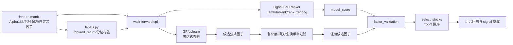

标签设计：

- 回归标签：`forward_return_20`, `forward_return_60`, 风险调整后未来收益
- 排序标签：同一交易日内未来收益分位数, Top 20% / Bottom 20% 分组标签

训练规范（所有 ML 路线通用）：

- 时间切分优先，不使用随机切分。
- 区分训练集、验证集、测试集、样本外区间。
- 记录：数据版本、特征版本、标签定义、训练时间区间、参数配置、模型产物路径。
- 所有候选因子/模型分数统一经过：IC / RankIC、分组收益、换手率、稳定性、样本外表现、交易成本敏感性。

#### 4.2.4 `factor_engine` 子架构

```text
factor_engine/
├── registry.py                # 因子注册表
├── base.py                    # 因子基类与统一接口
├── context.py                 # 计算上下文、市场配置、时间窗口
├── expressions/               # 规则与表达式因子
│   ├── operators.py           # 算子库: ts_mean, rank, delay, corr...
│   ├── alpha_factors.py       # 经典 alpha 因子
│   └── parser.py              # 表达式解析与执行
├── signals/                   # 信号配方框架
│   ├── base.py                # SignalRecipe 基类
│   ├── conditions.py          # 通用条件
│   └── combinators.py         # 条件组合器
├── ml/                        # [P1] LightGBM 路线
│   ├── features.py            # 特征拼装
│   ├── labels.py              # 收益标签、分类标签
│   ├── lightgbm_ranker.py     # LambdaRank / rank_xendcg 排序学习
│   └── feature_selection.py   # 特征筛选与重要性分析
├── deep/                      # [P2] Transformer 路线
│   ├── datasets.py            # 时序样本构造
│   ├── transformer.py         # 时序 Transformer 模型
│   ├── trainer.py             # 训练、验证、早停
│   └── inference.py           # 批量推理与因子输出
├── symbolic/                  # [P2] 符号回归路线
│   ├── function_set.py        # gplearn 函数集
│   ├── search.py              # 表达式搜索
│   ├── fitness.py             # IC/RankIC/复杂度/换手率多目标适应度
│   └── export.py              # 候选公式导出
├── postprocess/
│   ├── neutralize.py          # 行业/市值中性化
│   ├── standardize.py         # 标准化和去极值
│   └── combine.py             # 因子合成与加权
└── cache/
    └── storage.py             # 中间结果缓存
```

> **注意**：`ml/`、`deep/`、`symbolic/` 三个子目录在当前阶段（Phase 1-2）仅为代码组织占位，实际实现按 4.2.3 节优先级逐步填充，不追求一次性建完。

#### 4.2.5 统一接口

所有因子生成器（表达式、ML 模型、GP 搜索、信号配方）实现以下接口：

| 方法 | 用途 | 适用对象 |
|---|---|---|
| `fit(train_frame, valid_frame=None, config=None)` | 训练/估计 | LightGBM, Transformer, gplearn |
| `transform(frame, context=None)` | 因子计算 | 所有因子生成器 |
| `fit_transform(train_frame, valid_frame=None, config=None)` | 训练并输出训练期结果 | LightGBM, Transformer, gplearn |
| `predict(frame, context=None)` | 样本外打分/预测 | LightGBM, Transformer |
| `metadata()` | 返回因子名、依赖字段、参数、版本号 | 所有因子生成器 |

数据流：

1. `data/store` 提供标准化行情和特征底表
2. `factor_engine/expressions` 计算基础规则因子
3. `factor_engine/signals` 提供条件组合框架，`strategy_signals/` 存放具体形态配方
4. `factor_engine/ml` 将基础因子和原始特征拼成训练集，供 LightGBM 学习
5. `factor_engine/deep` 将多资产时序窗口拼成序列样本，供 Transformer 学习
6. `factor_engine/symbolic` 从基础算子和原始特征出发，用 gplearn 搜索新表达式
7. 所有产出统一进入 `postprocess` 做标准化、中性化、合成
8. 最终因子送入 `factor_validation` 和 `backtest_engine`

### 4.3 策略执行与交易层

**职责：**

- 将研究信号转化为组合权重和真实订单。
- 提供回测撮合、模拟盘、实盘接入三种运行模式。
- 对接券商柜台和交易所 API，并内置风控。

**推荐技术栈：**

- 事件驱动策略框架：`VeighNa`
- 高性能回测/执行内核：参考 `nanoback` 思路
- 国内接口方向：`CTP / XTP / 易盛`

**落地建议**：先做事件驱动回测，再做纸面交易，再接模拟盘，最后接实盘。OMS/OEMS 至少记录：订单状态、持仓快照、资金曲线、风控拦截日志。

**模块设计图：**

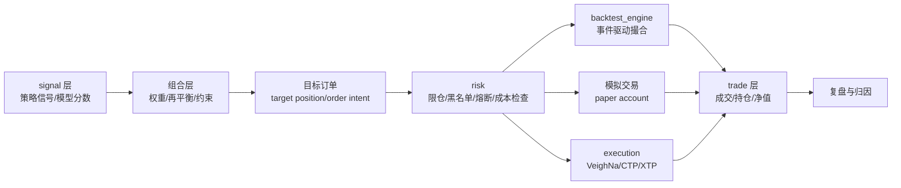

### 4.4 监控与 DevOps 层

**职责：**

- 监控数据延迟、任务失败率、策略收益波动、订单异常。
- 提供自动测试、自动发布、自动回滚。
- 建立模型与策略变更的审计链路。

**推荐建设内容：** 单元测试、集成测试、回测基准测试；任务编排与告警；运行日志与关键指标可视化；模型版本、参数版本、数据版本绑定。

**模块设计图：**

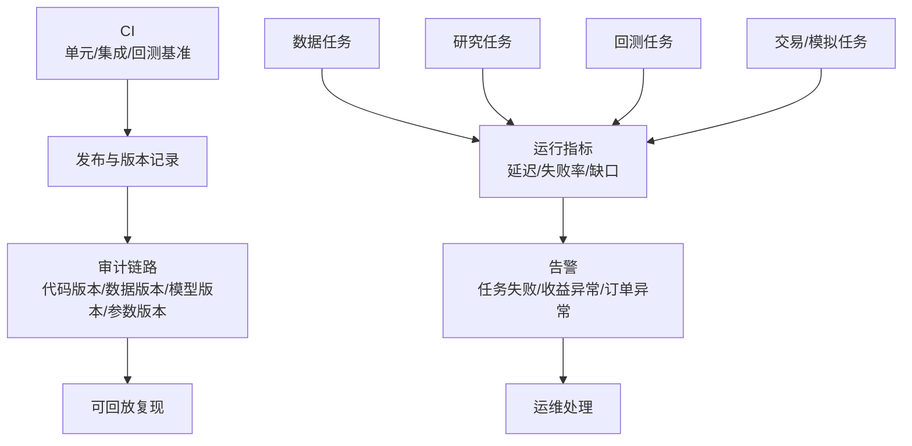

### 4.5 Web 展示与交互层

**职责：**

- 提供统一的浏览器端研究工作台，承接 K 线、因子、组合和回测结果展示。
- 支持研究人员动态切换股票、时间区间、因子、调仓频率和回测参数。

**推荐技术栈**：`Dash + Plotly`（主推荐），`Streamlit`（快速原型备选）。

**模块设计图：**

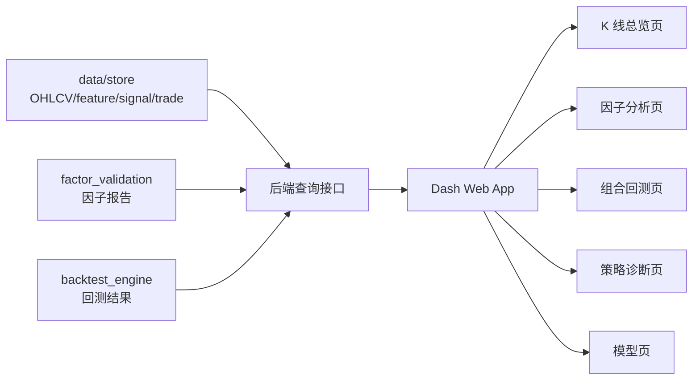

**建议展示能力：**

| 页面 | 内容 |
|---|---|
| K 线总览页 | 代码切换、时间区间切换、均线/成交量/技术指标叠加 |
| 因子分析页 | 单因子时序、横截面分布、IC/RankIC 曲线、分组收益和衰减分析 |
| 组合回测页 | 收益曲线、回撤曲线、超额收益、调仓记录、持仓分布 |
| 策略诊断页 | 参数面板、回测日志、风险暴露、绩效归因 |
| 模型页 | LightGBM 特征重要性、Transformer 训练曲线、gplearn 候选表达式及评分 |

## 5. 参考行业实践

### 5.1 头部私募经验

- **鸣石、多核平台思路**：因子工厂化、模块化、多策略协同。
- **海浦等万级因子库思路**：统一表达式体系、自动筛选、批量验证。
- **国内高频/低延迟团队**：流批一体、柜台速度、硬件网络优化。

### 5.2 开源框架对标

| 框架 | 定位 |
|---|---|
| `Qlib` | AI 驱动的研究流水线 |
| `DolphinDB` | 统一历史计算与实时流计算 |
| `FinRL-X` | AI 原生的策略实验框架 |
| `VeighNa` | 事件驱动执行与交易接口 |
| `Dash + Plotly` | 交互式浏览器研究看板 |
| `LightGBM` | 结构化因子的非线性建模和特征重要性排序 |
| `Time Series Transformer` | 多特征时间序列预测与复杂序列表示学习 |
| `gplearn` | 符号回归和可解释公式挖掘 |

## 6. 当前仓库现状映射

| 模块 | 路径 | 状态 |
|---|---|---|
| 数据抓取 | `data/ingest/providers/` | 已支持港股/A 股多源回退、批量同步、多周期抓取与分钟级派生 |
| 数据存储 | `data/store/` | `Parquet + DuckDB` 组合，layout/parquet_store/warehouse 已落地 |
| 数据标准化 | `data/model/` | 统一 OHLCV / stock info schema、交易日历、复权口径、质量巡检 |
| 因子引擎 | `factor_engine/` | 最小骨架可用：registry + base + expressions/operators + Alpha158/Alpha360 |
| 因子验证 | `factor_validation/` | 最小验证流水线可用，CLI 双模式分离（validate_factors / select_stocks） |
| 信号配方 | `strategy/` (legacy) | 有遗留实现，需按 `strategy_signals/` 目标架构重构 |
| 回测引擎 | `backtest_engine/` | 事件驱动撮合、费用/滑点、TopN 组合构建、全港股扫描 |
| 分析入口 | `analyzer_core.py` | 主分析链路已切到新数据架构，编排因子计算→验证→选股→回测 |
| 指标计算 | `indicators.py` | 技术指标库 |
| 报告展示 | `reporting.py`, `chart_plotter.py` | 基础报告与图表 |

**距离工业级系统仍缺少的关键能力：**

- `feature` 层版本管理、缓存机制与批量研究编排
- A 股企业行为、港股官方校验源与本地复权回放
- 信号配方框架层（`factor_engine/signals/`）和配方目录（`strategy_signals/`）
- LightGBM 排序学习流水线
- 批量研究任务编排与实验记录
- 订单管理与执行状态机
- 持仓/订单/风控日志的统一数据闭环
- Web 展示工作台
- 风控体系
- 监控与 CI/CD

## 7. 目标系统模块拆分

| 层级 | 模块 | 说明 |
|---|---|---|
| 数据层 | `data/ingest/` | 行情接入、多源抓取、批量同步、增量补数 |
| 数据层 | `data/model/` | 标准 schema、代码标准化、交易日历、复权 |
| 数据层 | `data/store/` | DuckDB/Parquet 抽象与分层读写 |
| 因子层 | `factor_engine/` | 表达式引擎、因子注册、ML/深度/符号路线、信号框架、后处理 |
| 因子层 | `factor_validation/` | IC、分组、回撤、稳定性分析 |
| 信号层 | `strategy_signals/` | 命名形态配方目录 |
| 研究层 | `research/` | Notebook、实验、模型训练任务 |
| 展示层 | `web_app/` | Dash 页面、Plotly 图表、交互回调 |
| 回测层 | `backtest_engine/` | 事件驱动撮合、费用、滑点、持仓管理 |
| 交易层 | `execution/` | 订单、拆单、经纪商网关 |
| 风控层 | `risk/` | 仓位、行业、单票、成交、熔断规则 |
| 运维层 | `ops/` | 监控、调度、发布、审计 |

**目标模块关系图：**

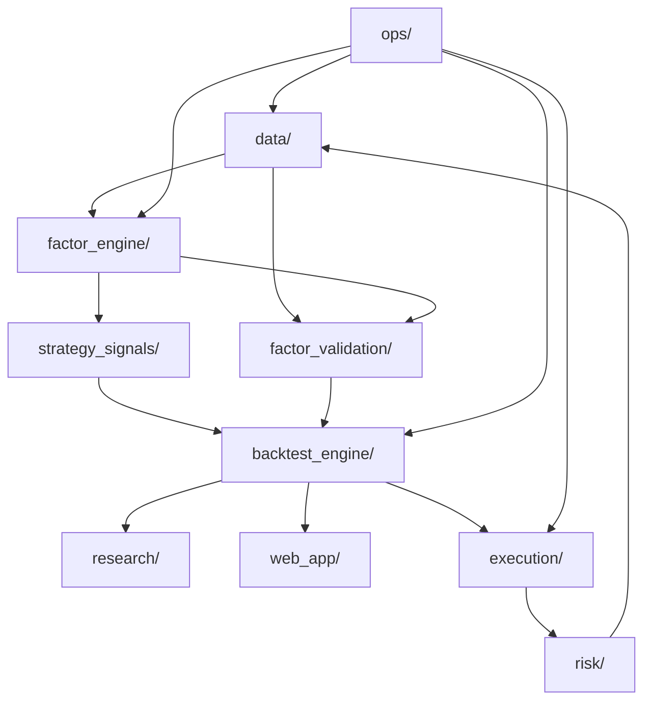

## 8. 分阶段实施路线

**阶段路线图：**

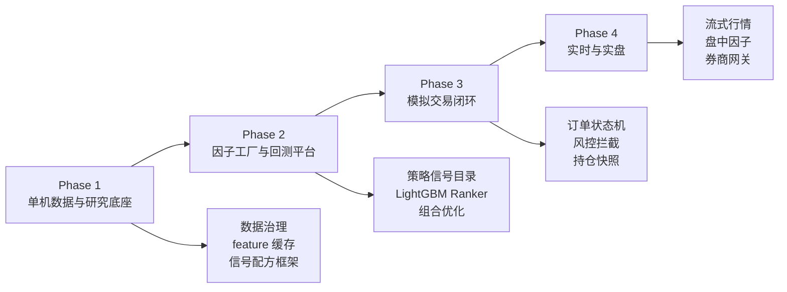

### Phase 1：夯实单机数据与研究底座

**目标**：把当前项目打造成稳定的单机研究平台。

**关键结果**：

- 统一数据 schema —— 已完成
- 支持日频/分钟频数据入湖 —— 已完成
- 补齐数据治理闭环（A 股企业行为、复权回放、停牌/节假日识别、自动修复流水线）
- `feature` 层版本管理与缓存
- 提供标准因子计算接口 —— 已完成
- 能跑基础单因子回测 —— 已完成
- 信号配方框架层落地（`factor_engine/signals/`）
- 遗留 `strategy/` 迁移至 `strategy_signals/`

### Phase 2：建立因子工厂与回测平台

**目标**：支持多因子批量验证和组合回测。

**关键结果**：

- 因子注册表 —— 已完成
- 因子批计算流水线 —— 已完成
- 信号配方目录初版（`strategy_signals/` 核心形态配方）
- LightGBM 排序学习基线（P1）
- IC/分组回测/组合优化
- 事件驱动回测内核 —— 已完成
- 组合层（等权/评分加权/风险预算）
- 实验记录与模型版本管理
- 可交互的 K 线、因子、模型与组合回测工作台（`web_app/`）
- 符号回归/GP 实验线（P2，视 P1 效果决定投入）
- 深度时序 Transformer 实验线（P2，视 P1 效果决定投入）

### Phase 3：建立模拟交易闭环

**目标**：把研究信号推进到仿真执行。

**关键结果**：

- 信号转订单
- 订单生命周期管理（订单状态机）
- 模拟撮合
- 风控规则与异常拦截
- 持仓快照/订单状态/风控日志持久化

### Phase 4：接入实时与实盘

**目标**：接入实时行情、模拟柜台和真实交易接口。

**关键结果**：

- 流式行情接入
- 盘中增量因子计算
- 券商 API 网关（VeighNa / CTP / XTP）
- 全链路监控与审计
- Redis 缓存与实时信号总线

### 8.1 下一步推进（Now / Next / Later）

#### Now：补数据治理闭环 + 信号配方框架

数据层基础版已成型，优先把数据治理的剩余缺口补上，同时建立信号配方的框架层，为后续因子研究提供稳定的基础设施。

- 企业行为层补齐（A 股企业行为、港股官方校验源、本地复权回放）
- 数据质量自动修复流水线（停牌识别、节假日缺口、复权一致性）
- `factor_engine/signals/` 框架（`base.py` / `conditions.py` / `combinators.py`）
- 遗留 `strategy/` 代码审计，规划迁移路径

#### Next：信号配方目录 + LightGBM 排序学习

把数据层正式接到研究层，形成"可批量计算、可验证"的因子工作流。

- `strategy_signals/` 核心形态配方（底部反弹、横盘突破、箱体回踩等）
- LightGBM 排序学习基线：
  - 因子矩阵构建 → 未来收益/横截面分位标签 → walk-forward 训练和验证 → 模型分数写回 feature/signal 层
- `factor_validation/` 批量化入口、IC/RankIC/分组收益报告汇总

#### Later：扩展回测、展示与自动化因子挖掘

- `backtest_engine/` 多资产订单生命周期、组合约束与再平衡
- `web_app/` K 线页、因子页、回测页、模型页
- 符号回归/GP 自动因子挖掘实验线
- 深度时序 Transformer 实验线

## 9. 建议的目录演进

```text
stock_analysis_by_gpt/
├── data/
│   ├── ingest/
│   ├── model/
│   └── store/
├── factor_engine/
│   ├── expressions/
│   ├── signals/          # 信号配方框架
│   ├── ml/               # [P1] LightGBM
│   ├── deep/             # [P2] Transformer
│   ├── symbolic/         # [P2] gplearn/GP
│   ├── postprocess/
│   └── cache/
├── strategy_signals/     # 命名形态配方目录
├── factor_validation/
├── research/
├── web_app/
├── backtest_engine/
├── execution/
├── risk/
├── ops/
├── reports/
└── assets/
```

## 10. 总结

这套系统的核心，不是简单把"抓数据、算指标、回测、下单"拼在一起，而是要建立一条统一、可复现、可扩展的研究到执行流水线。

对当前项目而言，最现实的演进路径不是一口气冲向分布式和低延迟，而是先把单机版的数据层、因子层和回测层做扎实。等这三层稳定后，再引入实时计算、订单管理、风控和交易接口，系统自然就会从分析工具长成真正的量化平台。

三层核心判断标准：

1. **数据层扎实**：任何因子计算、回测和信号生成，都不需要关心数据从哪来、有没有复权、交易日历对不对。
2. **因子层稳定**：批量计算、系统验证、可复现结果。手工因子和 ML 因子通过同一条验证流水线进入组合层。
3. **回测层可信**：撮合逻辑、费用、滑点真实反映交易成本，结果可落库可复盘。
