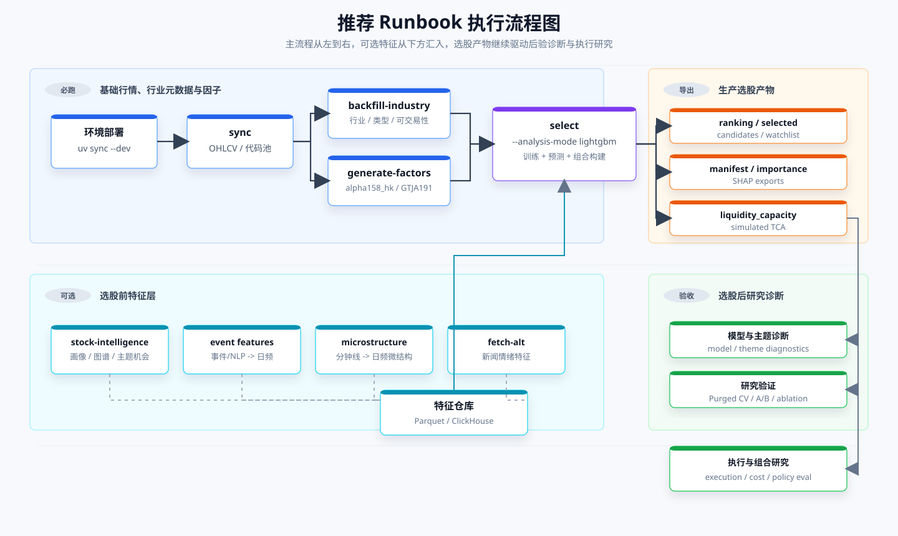

# 港股 / A 股量化研究与回测工具

基于 `ClickHouse + Parquet` 的本地量化研究工具箱，支持港股生产选股、A 股数据补全、因子生成、LightGBM 排序选股、行业分层候选池、组合回测和 Web 看板。

架构详见 [P0_01_quant_system_overall_design.md](./docs/todo/P0_01_quant_system_overall_design.md)，文档目录见 [docs/README.md](./docs/README.md)。

## 环境部署

```bash
curl -LsSf https://astral.sh/uv/install.sh | sh
uv python install 3.12.3
uv python pin 3.12.3
uv sync --dev

# macOS 上 LightGBM 需要 libomp
brew install libomp
```

项目通过 `pyproject.toml` 的 `[tool.uv.sources]` 将 `akshare` 指向同级目录 `../akshare`。如果本地目录结构不同，需要调整该路径。

### 一键部署可选服务

ClickHouse、SearXNG、LightRAG 本地依赖可以用统一脚本部署和校验。脚本会：

- 自动创建 `assets/clickhouse`、`deploy/searxng/cache` 等本地持久化目录。
- 自动执行 `cp deploy/lightrag/server.env.example deploy/lightrag/server.env`，但只在 `server.env` 不存在时创建，不覆盖已有本地配置。
- 部署 ClickHouse、SearXNG、LightRAG PostgreSQL/Ollama，并逐项输出部署和健康检查结果。
- 对 Docker Hub 拉取超时做重试，并在最终失败时提示是网络/镜像源问题还是服务健康检查问题。

```bash
# 默认部署 clickhouse,searxng,lightrag 并输出每部分结果
bash scripts/deploy_local_services.sh

# 只部署其中一部分
bash scripts/deploy_local_services.sh up --components clickhouse,searxng
bash scripts/deploy_local_services.sh up --components lightrag

# 只做健康检查
bash scripts/deploy_local_services.sh check

# 镜像拉取网络不稳定时增加重试
bash scripts/deploy_local_services.sh up --components lightrag --retries 5

# 只拉镜像，适合先验证 Docker Hub/镜像代理连通性
bash scripts/deploy_local_services.sh pull --components lightrag --retries 5

# 如果暂时不想拉 bge-m3 embedding 模型
bash scripts/deploy_local_services.sh up --components lightrag --skip-ollama-pull
```

脚本默认使用这些本地端口：ClickHouse HTTP `8123`、ClickHouse native `9000`、SearXNG `8888`、LightRAG PostgreSQL `15432`、Ollama `11434`、LightRAG API `9621`。端口被占用时可以在运行前覆盖环境变量，例如：

```bash
export CLICKHOUSE_HTTP_PORT=18123
export CLICKHOUSE_NATIVE_PORT=19000
export SEARXNG_PORT=18888
export POSTGRES_PORT=25432
export OLLAMA_PORT=21434
bash scripts/deploy_local_services.sh up
```

如果看到类似 `Get "https://registry-1.docker.io/v2/": net/http: request canceled while waiting for connection (Client.Timeout exceeded while awaiting headers)`，根因通常是 Docker Hub/网络代理/镜像源连通性超时，不是 LightRAG compose 配置本身坏了。先用 `bash scripts/deploy_local_services.sh pull --components lightrag --retries 5` 单独验证镜像拉取；仍失败时需要配置 Docker 代理或 registry mirror 后重跑。

### ClickHouse 可选

ClickHouse 可选。设置环境变量后，features 与 stock info registry 优先写入 ClickHouse；不可用时自动回退到 Parquet。

```bash
mkdir -p assets/clickhouse

# 如果宿主机 9000 已被占用，把 CLICKHOUSE_NATIVE_PORT 改成 19000 等备用端口。
export CLICKHOUSE_HTTP_PORT=${CLICKHOUSE_HTTP_PORT:-8123}
export CLICKHOUSE_NATIVE_PORT=${CLICKHOUSE_NATIVE_PORT:-9000}

docker run -d --name clickhouse \
  --restart unless-stopped \
  -p "${CLICKHOUSE_HTTP_PORT}:8123" -p "${CLICKHOUSE_NATIVE_PORT}:9000" \
  -v "$(pwd)/assets/clickhouse:/var/lib/clickhouse" \
  -e CLICKHOUSE_USER=default \
  -e CLICKHOUSE_PASSWORD=quant2024 \
  -e CLICKHOUSE_DB=quant \
  clickhouse/clickhouse-server

export CLICKHOUSE_HOST=localhost
export CLICKHOUSE_PORT="${CLICKHOUSE_HTTP_PORT}"
export CLICKHOUSE_USER=default
export CLICKHOUSE_PASSWORD=quant2024
export CLICKHOUSE_DATABASE=quant

# 可选：应用侧 ClickHouse 批量写入分块行数，默认 50000
export CLICKHOUSE_INSERT_CHUNK_ROWS=50000
```

`--restart unless-stopped` 会让 Docker 服务启动后自动拉起 ClickHouse 容器；`-v "$(pwd)/assets/clickhouse:/var/lib/clickhouse"` 将 ClickHouse 数据文件保存在项目的 `assets/clickhouse` 下，删除或重建容器时数据不会丢。`/var/lib/clickhouse` 是必须持久化的数据目录，应用侧数据库名使用 `CLICKHOUSE_DATABASE`，默认建议为 `quant`。本项目通过 HTTP 端口访问 ClickHouse，即容器内 `8123`；native 端口 `9000` 只给 clickhouse-client 或其他 native 协议工具使用。如果宿主机 `9000` 被占用，可以改用 `export CLICKHOUSE_NATIVE_PORT=19000` 后再执行 `docker run`，应用侧 `CLICKHOUSE_PORT` 仍然保持 HTTP 端口。

ClickHouse 写入上限由应用侧分块控制，不需要先改 ClickHouse server 配置。`data/store/clickhouse_store.py` 的 `_insert_frame()` 会读取 `CLICKHOUSE_INSERT_CHUNK_ROWS`，把一次 DataFrame 写入拆成多次 `insert_df()`；未设置时默认每批 `50000` 行。建议本地单机先保持默认；如果导入 stock info、features 或 OHLCV 时出现内存压力、HTTP payload 过大、连接被代理中断等问题，把它降到 `10000` 或 `20000`；如果机器内存充足且 ClickHouse 在本机 Docker 中运行，可以试到 `100000`。这个值只影响每次发给 ClickHouse 的 insert 行数，不改变最终写入行数，也不改变 `ReplacingMergeTree` 的去重逻辑。

`STOCK_INFO_LOOKUP_CHUNK_ROWS` 是股票元数据 upsert 前读取旧字段的查询分块，默认 `100`，和插入上限不是同一个配置。只有在回填行业/标的类型时查询条件过大或 ClickHouse 响应慢，才需要把它调小，例如：

```bash
export STOCK_INFO_LOOKUP_CHUNK_ROWS=50
```

### SearXNG 可选

SearXNG 用于本地聚合搜索 evidence，是 `stock-intelligence-pipeline` 的推荐搜索入口。它不是离线搜索引擎，仍会请求 Bing、DuckDuckGo 等上游搜索源；优势是统一缓存、统一 JSON API，并避免全市场流程逐股打开浏览器。

推荐优先使用一键脚本：

```bash
bash scripts/deploy_local_services.sh up --components searxng
bash scripts/deploy_local_services.sh check --components searxng

export SEARXNG_URL=http://127.0.0.1:8888
```

手动部署命令如下，适合排障时逐条执行：

```bash
mkdir -p deploy/searxng/searxng deploy/searxng/cache

docker compose -f deploy/searxng/docker-compose.yml up -d

curl 'http://127.0.0.1:8888/search?q=00700%20腾讯控股%20主营业务%20年报&format=json&language=zh-CN&categories=general'

export SEARXNG_URL=http://127.0.0.1:8888
```

`deploy/searxng/docker-compose.yml` 默认只绑定 `127.0.0.1:8888`，不要直接暴露公网。`deploy/searxng/searxng/settings.yml` 已启用 `json` format，否则 `/search?format=json` 会返回 403；默认启用 Bing 和 DuckDuckGo，禁用 Google 以减少验证码和风控。若 `8888` 被占用，可以临时改 `deploy/searxng/docker-compose.yml` 的宿主机端口，例如 `127.0.0.1:18888:8080`，并同步设置 `SEARXNG_URL=http://127.0.0.1:18888`。完整说明和排障见 `docs/done/P0_03_searxng_search_integration.md`。

### LightRAG 可选

LightRAG 只用于 evidence 索引、主题/股票画像召回和重点股票深挖；全市场生产流程默认用 `--profile-stage skip`，不逐股做昂贵问答。部署分两层：Docker 跑 PostgreSQL/pgvector/AGE；若需要本地 embedding，再显式启用 Ollama profile；宿主机运行上游 LightRAG API server。

推荐先用一键脚本部署并校验 Docker 层：

```bash
bash scripts/deploy_local_services.sh up --components lightrag
bash scripts/deploy_local_services.sh check --components lightrag

# 可选：本地 Ollama 镜像约 3GB+，只在确实需要本地 embedding 时启用
bash scripts/deploy_local_services.sh up --components lightrag --with-ollama
```

脚本会在缺少配置时自动创建：

```bash
cp deploy/lightrag/server.env.example deploy/lightrag/server.env
```

它不会覆盖已经存在的 `deploy/lightrag/server.env`。首次部署后仍建议打开这个文件确认 `POSTGRES_PASSWORD`、`LLM_MODEL`、`LLM_BINDING_HOST` 等本地配置。LightRAG API server 依赖上游 `../LightRAG` 和 `DEEPSEEK_API_KEY`，脚本只会把 API 健康检查列为单独结果；如果 API 未启动，会提示用 `deploy/lightrag/start-server.sh` 启动。

`deploy/lightrag/docker-compose.yml` 默认不再拉取 `gzdaniel/postgres-for-rag:pg18-age-pgvector`，因为该自定义镜像容易受 Docker Hub/mirror 白名单影响。PostgreSQL 会从同级 `../LightRAG/Dockerfile.postgres` 本地构建 `stock-lightrag-postgres:pg18-age-pgvector-local`，第一次构建会下载 pgvector 基础镜像、Debian 编译依赖并编译 Apache AGE，耗时会比直接 pull 更长；构建完成后镜像会留在本机。若你已经有内部镜像，可以运行前覆盖：

```bash
export LIGHTRAG_POSTGRES_IMAGE=registry.example.com/postgres-for-rag:pg18-age-pgvector
export LIGHTRAG_POSTGRES_PULL_POLICY=missing
export OLLAMA_IMAGE=registry.example.com/ollama/ollama:latest
```

Ollama 被放在 compose profile 中，默认命令不会拉取 3GB+ 的 `ollama/ollama` 镜像：

```bash
# 默认只启动 PostgreSQL，不拉 Ollama
docker compose --env-file deploy/lightrag/server.env -f deploy/lightrag/docker-compose.yml up -d

# 确认需要本地 embedding 时再启用 Ollama
docker compose --profile ollama --env-file deploy/lightrag/server.env -f deploy/lightrag/docker-compose.yml up -d
docker exec stock-lightrag-ollama ollama pull bge-m3
```

手动部署流程如下，适合排障时逐条执行：

```bash
# 1) 准备 LightRAG 运行环境变量
cp deploy/lightrag/server.env.example deploy/lightrag/server.env
# 编辑 deploy/lightrag/server.env，至少确认 POSTGRES_PASSWORD、LLM_MODEL 等配置

# 2) 启动 PostgreSQL
docker compose --env-file deploy/lightrag/server.env -f deploy/lightrag/docker-compose.yml up -d

# 可选：启用本地 Ollama embedding 服务
docker compose --profile ollama --env-file deploy/lightrag/server.env -f deploy/lightrag/docker-compose.yml up -d
docker exec stock-lightrag-ollama ollama pull bge-m3

# 3) 安装上游 LightRAG API server
cd ../LightRAG
uv sync --extra api --extra offline-storage --extra offline-llm

# 4) 回到本项目启动 LightRAG API
cd ../stock_analysis_by_gpt
export LIGHTRAG_PATH="$(cd ../LightRAG && pwd)"
export DEEPSEEK_API_KEY=...
bash deploy/lightrag/start-server.sh
```

如果不想占用当前终端，可以用 `tmux` 后台启动：

```bash
cd /home/yuxun/quant/stock_analysis_by_gpt
tmux new -d -s lightrag 'LIGHTRAG_PATH=/home/yuxun/quant/LightRAG DEEPSEEK_API_KEY=... bash deploy/lightrag/start-server.sh'

# 查看会话
tmux ls

# 进入会话查看日志；退出但不停止服务：Ctrl+b，然后按 d
tmux attach -t lightrag

# 停止服务
tmux kill-session -t lightrag
```

启动后检查 `http://127.0.0.1:9621/health`，API 文档在 `http://127.0.0.1:9621/docs`。`start-server.sh` 会读取 `deploy/lightrag/server.env` 和当前 shell 中的 `DEEPSEEK_API_KEY`，不会把 API key 写入仓库。更完整的后端取舍和排障见 `docs/done/P0_02_lightrag_deployment.md`，部署脚本说明见 `deploy/lightrag/README.md`。

## 推荐 Runbook

README 以依赖顺序组织流程：基础行情、行业元数据和因子是生产选股硬依赖；画像、事件、微结构、新闻情绪是选股前可选特征层；模型诊断、TCA、执行模拟和组合策略评估都消费 `select` 的导出结果。港股链路是当前生产选股主路径；A 股链路先按腾讯、AkShare 新浪、BaoStock、东方财富的顺序补齐日线数据，再用 `--market CN` 生成因子、LightGBM 排序选股和研究回测。基础标签流水线已经退出推荐流程；LightRAG 只用于 evidence 索引和重点股票深挖，不作为全市场逐股在线问答引擎。

```text
基础数据:
  sync -> backfill-industry
       -> generate-factors

A 股选股:
  sync-cn -> refresh-cn-stock-info
          -> refresh-cn-financial-metrics
          -> backfill-cn-industry
          -> generate-factors --market CN
          -> select --market CN --analysis-mode lightgbm

选股前可选特征层:
  stock-intelligence-pipeline -> theme_opportunity features
  export-event-features -> event_daily features
  export-microstructure-features -> intraday_microstructure features
  fetch-alt -> alt_sentiment features

生产选股:
  select --analysis-mode lightgbm
    -> ranking / selected / candidates / watchlist
    -> liquidity_capacity / simulated TCA
    -> LightGBM manifest / feature importance / SHAP exports

选股后研究诊断:
  lightgbm-model-diagnostics / theme-feature-diagnostics
  lightgbm-abtest / theme-ablation / lightgbm-purged-cv-report
  execution-simulate / fit-execution-cost-model / portfolio-policy-eval
```

### 执行流程图



| 场景 | 前置依赖 | 跑什么 | 频率 |
|---|---|---|---|
| 第一次部署 | 无 | `uv sync --dev`，可选部署 ClickHouse、SearXNG、LightRAG | 只跑一次 |
| 第一次建库或行情更新 | 无 | `sync` | 初次全量，之后按交易日增量 |
| A 股第一次建库或行情更新 | 无 | `sync-cn` | 初次全量，之后按交易日增量 |
| 财务/流动性快照刷新 | `sync` 产生代码池 | `refresh-stock-info` | 每个交易日收盘后，或选股前 |
| A 股财务/流动性快照刷新 | `sync-cn` 产生代码池 | `refresh-cn-stock-info` | 每个交易日收盘后，或回测前 |
| 财务因子面板刷新 | `refresh-stock-info` 已落库 | `refresh-financial-metrics`、`financial-coverage` | 每个交易日收盘后，或财务数据更新后 |
| A 股估值/财务面板刷新 | `refresh-cn-stock-info` 已落库 | `refresh-cn-financial-metrics`、`cn-coverage-check` | 每个交易日收盘后，或财务数据更新后 |
| 行业、标的类型、可交易性刷新 | `sync` 产生代码池 | `backfill-industry`、`industry-coverage` | 新股票或元数据过期时 |
| A 股行业刷新 | `sync-cn` 产生代码池 | `backfill-cn-industry`、`cn-coverage-check` | 新股票或元数据过期时 |
| 因子刷新 | `sync` 产生 OHLCV | `generate-factors --factor-set alpha_zoo_hk` | 每次重训/选股前 |
| A 股因子刷新 | `sync-cn` 产生 CN OHLCV，建议先过 `cn-coverage-check` | `generate-factors --market CN --factor-set alpha_zoo_hk` | 每次重训/选股前 |
| 智能画像/主题特征刷新 | SearXNG、LightRAG、别名/evidence | `stock-intelligence-pipeline --import-to-warehouse` | 按周/月，或研究主题变化时 |
| 事件/微结构实验特征 | 外部事件 CSV 或分钟线 CSV | `export-event-features`、`export-microstructure-features`，再接入特征仓库 | 研究需要时，在 `select` 前 |
| 生产选股 | `sync`、`refresh-stock-info`、`generate-factors`；强烈建议先 `backfill-industry`；可叠加特征层 | `select --analysis-mode lightgbm --export-csv output/results` | 每次要出组合 |
| A 股研究选股 | `sync-cn`、`refresh-cn-stock-info`、`refresh-cn-financial-metrics`、`backfill-cn-industry`、`generate-factors --market CN` | `select --market CN --analysis-mode lightgbm --export-csv output/results_cn` | 每次要出 A 股研究组合 |
| 选股后验收 | `select` 导出的 ranking/selected/feature artifacts | `lightgbm-model-diagnostics`、`theme-feature-diagnostics`、Purged CV、A/B、TCA/RL | 每次模型或特征变化后 |

### 港股日常选股

```bash
uv run python run.py sync --start-date 2014-01-01 --frequencies daily --skip-existing --max-workers 24 --show-progress
uv run python run.py refresh-stock-info --max-workers 16 --show-progress
uv run python run.py refresh-financial-metrics --max-workers 8 --show-progress
uv run python run.py backfill-industry --force --normalize-existing --max-workers 8 --show-progress
uv run python run.py generate-factors --days 365 --factor-set alpha_zoo_hk --max-workers 8 --show-progress
uv run python run.py select \
  --analysis-mode lightgbm \
  --top-n 10 \
  --days 365 \
  --factor-set alpha_zoo_hk \
  --min-market-cap 30 \
  --min-daily-turnover 500 \
  --max-workers 8 \
  --export-csv output/results \
  --show-progress
```

### A 股日常选股

```bash
uv run python run.py sync-cn --start-date 2014-01-01 --frequencies daily --skip-existing --complete-data --max-workers 12 --show-progress
uv run python run.py refresh-cn-stock-info --max-workers 8 --show-progress
uv run python run.py refresh-cn-financial-metrics --max-workers 4 --show-progress
uv run python run.py backfill-cn-industry --show-progress
uv run python run.py generate-factors --market CN --days 365 --factor-set alpha_zoo_hk --max-workers 8 --show-progress
uv run python run.py select \
  --market CN \
  --analysis-mode lightgbm \
  --top-n 10 \
  --days 365 \
  --factor-set alpha_zoo_hk \
  --max-workers 8 \
  --export-csv output/results_cn \
  --show-progress
```

如果要在生成因子前先验收 A 股数据链路，可以在第 4 步后插入：

```bash
uv run python run.py cn-coverage-check --min-ohlcv-rows 120 --json
```

`sync-cn --complete-data` 会在行情同步后继续补齐 `stock_info_registry`、`valuation_snapshot`、`financial_statement_metrics` 和行业字段；补全阶段失败会进入 summary，不回滚已经写入的 OHLCV。只想快速补行情时可以去掉 `--complete-data`；只有临时调试需要旧逐股行为时，才额外加 `--include-stock-info`。

小样本先跑指定股票，确认腾讯优先链路、AkShare 新浪/BaoStock/东方财富兜底、仓库写入、因子落库和选股都通：

```bash
uv run python run.py sync-cn --stock-codes 600000.SH 000001.SZ --start-date 2020-01-01 --frequencies daily --complete-data --max-workers 2 --show-progress
uv run python run.py refresh-cn-stock-info --stock-codes 600000.SH 000001.SZ --max-workers 2 --show-progress
uv run python run.py refresh-cn-financial-metrics --stock-codes 600000.SH 000001.SZ --max-workers 2 --show-progress
uv run python run.py backfill-cn-industry --stock-codes 600000.SH 000001.SZ --show-progress
uv run python run.py generate-factors --market CN --stock-codes 600000.SH 000001.SZ --days 365 --factor-set alpha_zoo_hk --max-workers 2 --show-progress
uv run python run.py select --market CN --analysis-mode lightgbm --stock-codes 600000.SH 000001.SZ --top-n 2 --days 365 --factor-set alpha_zoo_hk --max-workers 2 --export-csv output/results_cn_smoke --show-progress
```

小样本验链路同样可以在第 4 步后插入：

```bash
uv run python run.py cn-coverage-check --stock-codes 600000.SH 000001.SZ --min-ohlcv-rows 120 --json
```

`select --analysis-mode lightgbm` 会在单次命令内训练和预测，不依赖 `validate-factors`。生产默认 `--factor-set alpha_zoo_hk`、`--model-objective regression_csrank`、`industry_size` 中性化；`lambdarank` 和 `rank_xendcg` 只作为对照实验。只有旧的 `select --analysis-mode factor` 才需要先跑 `validate-factors`。

`refresh-stock-info` 会把 PB、PE、市值、成交额、成交量、总股本、流通股本、股息率和换手率等快照写入 `stock_info_registry`。换手率字段有原始数据时直接入库；缺失时按 `成交量 / 流通股本 * 100` 换算后入库。生产选股默认优先使用仓库里的财务/流动性快照做流动性过滤和 LightGBM 估值评分，不再临时抓 live 数据；仅当显式设置 `ALLOW_LIVE_MARKET_FILTER_FETCH=1` 时，市场过滤才会对缺失股票启用实时兜底。

`refresh-financial-metrics` 会把本地 `stock_info_registry` 的估值/流动性字段转存到 `valuation_snapshot`，并写入 `financial_statement_metrics` 的 PIT 财务面板；`financial-coverage` 用于检查字段覆盖率。因子目录已支持 `factor-list`、`factor-show`、`factor-manifest`，生产默认 `alpha_zoo_hk` 包含 `alpha101`、`academic_hk`、`valuation_hk`、`financial_quality_hk` 和 `financial_cross_section_hk`。其中 `financial_cross_section_hk` 会生成 `pe_ind_pct`、`pb_ind_pct`、`roe_ind_pct`、`quality_value_score` 等行业相对财务因子。这些实现只参考 Alpha Zoo 的组织形态，代码、公式代理、manifest 和落库流程都在本项目内原生实现，不读取、不导入、也不要求存在 `Vibe-Trading/` 目录。

`select --export-csv output/results` 会同时导出排名、持仓、候选池、观察名单、行业归因、流动性容量、模拟 TCA、模型 manifest、特征重要性和 SHAP 解释文件。后续诊断、成本模型和组合策略评估都应消费这些产物，不要反向依赖选股前的原始特征文件。

### A 股回测入口说明

A 股日线基础行情默认优先使用腾讯，再回退 AkShare 新浪、BaoStock，最后才短超时回退东方财富；分钟线继续走 AkShare/Eastmoney。A 股流程先把 `CN` 分区的数据补齐，再用 `cn-coverage-check` 判断是否达到回测条件。只有明确要压测或排查 BaoStock 时，才给 `sync-cn` 显式加 `--data-source baostock`；只有明确要排查东方财富时，才显式加 `--data-source eastmoney`。

`sync-cn` 会给 AkShare 内部未显式设置 timeout 的 HTTP 请求补默认超时，避免坏 IP 把尾部股票长时间挂在 `SYN-SENT`。默认 `CN_SYNC_SOCKET_TIMEOUT=5` 秒；网络较差时可以调大，想更快跳过坏连接时可以调小，例如：

```bash
CN_SYNC_SOCKET_TIMEOUT=3 uv run python run.py sync-cn --start-date 2014-01-01 --frequencies daily --skip-existing --complete-data --max-workers 24 --show-progress
```

A 股 OHLCV 同步会按完成结果分批落库，默认每 `64` 只股票或 `250000` 行 flush 一次，避免全市场数据全部堆在内存里等最后才写。需要更频繁看到数据库增长时可以调小 `CN_SYNC_FLUSH_STOCKS` 或 `CN_SYNC_FLUSH_ROWS`：

```bash
CN_SYNC_SOCKET_TIMEOUT=3 CN_SYNC_FLUSH_STOCKS=32 uv run python run.py sync-cn --start-date 2014-01-01 --frequencies daily --skip-existing --complete-data --max-workers 24 --show-progress
```

`sync-cn --show-progress` 的进度条会显示最近完成的股票和来源简写，例如 `last=600000.SH:tx`，并累计来源分布 `src=tx:92,sn:31,bs:5,em:0`。简写含义：`tx` 腾讯，`sn` 新浪，`bs` BaoStock，`em` 东方财富。

`cn-coverage-check` 会检查 A 股股票池、`daily/qfq` OHLCV、`stock_info_registry`、行业字段、`valuation_snapshot`、`financial_statement_metrics`、feature 层以及 `StockAnalyzer(market="CN")` 的样本读取结果。报告里的 `backtest_ready` 为 `false` 时，先看 `blocking_reasons`；常见阻断包括 `cn_universe_empty`、`cn_ohlcv_rows_below_threshold` 和 `stock_analyzer_cn_load_failed`。

小样本调试时可以指定股票池，避免首次直接全市场跑：

```bash
uv run python run.py sync-cn \
  --stock-codes 600000.SH 000001.SZ \
  --start-date 2020-01-01 \
  --frequencies daily \
  --max-workers 2 \
  --show-progress

uv run python run.py cn-coverage-check \
  --stock-codes 600000.SH 000001.SZ \
  --min-ohlcv-rows 120 \
  --json
```

`generate-factors` 和 `select` 默认市场仍是 `HK`；A 股需要显式加 `--market CN`。如需在 notebook 或脚本里做更细的研究回测，也可以直接构造 `StockAnalyzer(market="CN")`：

```python
from core import StockAnalyzer

analyzer = StockAnalyzer(market="CN")
try:
    result = analyzer.backtest_portfolio(
        stock_codes=["600000.SH", "000001.SZ"],
        days=365,
        top_n=2,
        analysis_mode="lightgbm",
        factor_set="alpha_zoo_hk",
        max_workers=2,
        show_progress=True,
    )
finally:
    analyzer.close()
```

如果本地设置了 `CLICKHOUSE_HOST`，A 股数据会和港股一样优先写 ClickHouse，不可用时回退 Parquet。只想检查本地 Parquet 时，可以临时清掉 ClickHouse 环境变量：

```bash
env -u CLICKHOUSE_HOST -u CLICKHOUSE_PORT -u CLICKHOUSE_HTTP_PORT \
  uv run python run.py cn-coverage-check --limit 20 --json
```

### 国泰君安 191 因子

生产默认使用更完整的 `alpha_zoo_hk`。它包含 `alpha158_hk`，并额外加入 `alpha101`、`academic_hk`、`valuation_hk`、`financial_quality_hk` 和 `financial_cross_section_hk`；`alpha158_hk` 继续保留为轻量回退包，适合小样本调试或需要更快生成因子时使用。`alpha158_hk` 本身已经合并国泰君安 191 因子，输出中会同时包含 Qlib Alpha158、9 个港股定制因子，以及 `GTJA001` 到 `GTJA191`：

```bash
uv run python run.py generate-factors \
  --days 365 \
  --factor-set alpha_zoo_hk \
  --max-workers 8 \
  --show-progress

uv run python run.py factor-report \
  --days 365 \
  --factor-set alpha_zoo_hk \
  --export-csv output/factor_report_alpha_zoo_hk \
  --show-progress

uv run python run.py select \
  --analysis-mode lightgbm \
  --top-n 10 \
  --days 365 \
  --factor-set alpha_zoo_hk \
  --max-workers 8 \
  --export-csv output/results \
  --show-progress
```

如需单独评估 GTJA191 的边际贡献，可以临时使用 `--factor-set gtja_alpha191` 跑 `factor-report` 或小样本对照。注意：原始 GTJA191 中的 `RANK(x)` 是横截面排名，本项目当前因子物化是单股 OHLCV 流式计算，因此内置实现用滚动时序百分位做代理，并在 metadata 中标明。建议让 LightGBM 做特征选择，不建议把 191 个因子等权用于 factor 模式。

### 智能画像/主题特征刷新

```bash
uv run python run.py stock-intelligence-pipeline \
  --searxng-url http://127.0.0.1:8888 \
  --lightrag-url http://127.0.0.1:9621 \
  --engines bing,duckduckgo \
  --max-workers 8 \
  --query-workers-per-stock 2 \
  --profile-stage skip \
  --import-to-warehouse \
  --show-progress
```

默认不需要手动指定 `--theme` 或 `--stock-codes`：股票池从 deep evidence/本地股票 registry 自动识别，主题从图谱节点、别名和 evidence 自动发现。`--profile-stage skip` 是全市场生产默认值，会跳过昂贵的逐股 LightRAG 问答，直接用 evidence/别名/规则图谱生成选股特征；专项研究才加 `--themes 大模型 推理算力 机器人`，小样本调试才加 `--stock-codes 02513`。

生产刷新不要加 `--top-n`。流水线默认对每个主题输出全市场股票分数，用于 LightGBM 特征生产；`--top-n` 只适合临时调试或生成报告榜单。若生产时加了 `--top-n 100`，主题特征会被截断成每个主题只覆盖前 100 只，最终大部分股票画像分为 0，选股收益很难真实受益。

LightRAG 的合理用法是两段式：

```bash
# 全市场：只做搜索、索引、规则图谱、热度、主题特征，不逐股问答
uv run python run.py stock-intelligence-pipeline \
  --searxng-url http://127.0.0.1:8888 \
  --lightrag-url http://127.0.0.1:9621 \
  --engines bing,duckduckgo \
  --profile-stage skip \
  --import-to-warehouse \
  --show-progress

# 重点股票：对少量候选做 LightRAG 深挖画像
uv run python run.py stock-intelligence-pipeline \
  --lightrag-url http://127.0.0.1:9621 \
  --skip-aliases \
  --skip-research \
  --skip-lightrag-index \
  --stock-codes 02513 00700 \
  --profile-stage full \
  --profile-workers 2 \
  --profile-query-workers 3 \
  --top-k 20 \
  --chunk-top-k 10 \
  --show-progress
```

画像特征进入 LightGBM 训练面板默认开启；最终排名 overlay 默认关闭。确认主题特征 OOS 有效后，再用小权重打开：

```bash
uv run python run.py select \
  --analysis-mode lightgbm \
  --top-n 10 \
  --days 365 \
  --factor-set alpha_zoo_hk \
  --theme-feature-set theme_opportunity \
  --theme-overlay-strength 0.05 \
  --export-csv output/results \
  --show-progress
```

`--theme-overlay-strength` 建议从 `0.05` 起步，最高通常不超过 `0.10-0.15`；主题分只做增强和解释，不应压过价格、质量、风险主信号。

跑完选股后，用诊断命令检查智能画像是否真的贡献了有效覆盖，而不是只生成了空特征：

```bash
uv run python run.py lightgbm-model-diagnostics \
  --ranking-csv output/results_alpha_zoo_hk_ranking.csv \
  --selected-csv output/results_alpha_zoo_hk_selected.csv \
  --output-json output/lightgbm_model_diagnostics.json

uv run python run.py theme-feature-diagnostics \
  --ranking-csv output/results_alpha_zoo_hk_ranking.csv \
  --selected-csv output/results_alpha_zoo_hk_selected.csv \
  --theme-feature-csv output/theme_opportunity_features.csv
```

`lightgbm-model-diagnostics` 重点看 `selected_high_chase_rate`、`selected_60d_multibagger_rate`、`selected_120d_multibagger_rate`、`selected_near_52w_high_rate` 和 `selected_high_chase_stocks`。如果持仓里出现过去 60/120 日翻倍、接近 52 周高点且 `high_chase_score` 很高的股票，这不是“正常强势”，而是追高红旗；应先确认是否被 `eligibility_reasons` 拦截，并用中性化/特征家族/主题 ablation 查模型是不是被短期动量主导。

重点看 `theme_feature_stock_coverage_rate`、`theme_opportunity_score` 的 `non_zero_rate`、高分桶平均收益、持仓里 `non_zero` 的数量，以及主题分质量里的 `high_score_zero_relevance_rate`。若 `avg_stocks_per_feature_name` 接近 100 且覆盖率很低，通常是生产命令误加了 `--top-n`，先不带 `--top-n` 重跑智能画像特征；若 `high_score_zero_relevance_rate` 偏高，说明旧主题分被泛热度/泛证据顶高，需要用相关性闸门版本重跑主题分；若全量输出后非零覆盖仍低于 20%，再扩大主题体系或补充行业主题；若高分桶没有更高胜率，不要提高 overlay 权重。

选股导出文件语义：

| 文件 | 含义 |
|---|---|
| `*_ranking.csv` | 全市场排名和解释字段 |
| `*_selected.csv` | 最终当前持仓，只包含 `selected=True` |
| `*_candidates.csv` | 进入组合构建但未最终持有的候选 |
| `*_watchlist.csv` | 观察名单/弱信号/被风控降级的标的 |

## 数据与存储

默认写入本地 Parquet：

| 数据 | 路径 |
|---|---|
| OHLCV | `assets/data/clean/ohlcv` |
| 股票元数据 | `assets/data/meta/stock_info_registry` |
| 信号批次 | `assets/data/signal` |
| 回测交易 | `assets/data/trade` |
| ClickHouse 数据卷 | `assets/clickhouse` |

ClickHouse 是可选加速后端，部署方式和写入分块配置见上面的环境部署章节。未设置 `CLICKHOUSE_HOST` 时项目只使用本地 Parquet。

## 行业分层选股

`backfill-industry` 依赖 `sync` 产生的港股代码池，不依赖因子生成。它会写入：

| 字段 | 用途 |
|---|---|
| `industry_l1/l2/l3` | 真实行业分类、行业内 TopN、覆盖率检查 |
| `instrument_type` | `common_stock` / `fund_like` / `reit` 等标的类型 |
| `is_fund_like` | 硬排除 ETF、基金、REIT、杠杆反向、结构化产品 |
| `tradable_flag` | 停牌或不可交易标的硬过滤 |

覆盖率优先看普通股口径：

如果当前网络环境无法从公开接口拿到行业信息，可以先准备与 `docs/hk_industry_registry.csv` 同格式的本地 CSV，再导入到同一个 `stock_info_registry`：

```bash
uv run python run.py backfill-industry \
  --industry-registry-csv docs/hk_industry_registry.csv \
  --normalize-existing \
  --show-progress
```

导入模式不会访问网络，CSV 中的 `stock_code`、`industry_l1`、`industry_l2`、`industry_source`、`instrument_type`、`is_fund_like`、`tradable_flag` 等字段会写入 registry；已有价格、市值、估值等非空字段会保留。

```bash
uv run python run.py industry-coverage --show-missing
```

重点指标是 `ordinary_l1_rate` / `ordinary_l2_rate`。港股 `03/09/28/30/31/34/72/73/75/77` 等代码段大量是 ETF、基金、杠杆反向或结构化产品，会被统计为 fund-like，不应按普通股票要求行业覆盖。

## 股票智能画像 Registry

行业表用于稳定分层；股票智能画像用于更细的主题、资源、产业链和业务关联。主流程使用 LightRAG-first 画像系统，不再依赖基础标签流水线。

| 文件 | 用途 |
|---|---|
| `docs/hk_entity_alias_registry.csv` | 股票别名、英文名、产品名和模型名，用于深度画像检索 |
| `docs/hk_stock_deep_evidence.csv` | source-aware 深度画像 evidence |
| `docs/hk_stock_profile.csv` | 股票画像摘要和结构化 JSON |
| `docs/hk_stock_deep_tag_registry.csv` | 产品/技术/催化/瓶颈等细分标签 |
| `docs/hk_stock_graph_nodes.csv` / `docs/hk_stock_graph_edges.csv` | 股票画像图谱节点和边 |

批量生成的单股画像报告、LightRAG context、临时图谱 CSV 和主题评分默认写入已忽略的 `output/`，不要提交到 `docs/`。`docs/` 只保留设计文档、小型 registry 和可复现命令；上千只股票的结构化结果应导入 Parquet/ClickHouse 仓库，可读报告和大 JSON 作为本地 artifact 保存在 `output/stock_profiles/HK/<stock_code>/`。

### 最优整合画像流水线

这是推荐主流程。它把别名、source-aware 搜索、LightRAG 索引/召回、强 schema 图谱、热度、主题机会分、LightGBM 标准特征串在一条命令里。DeepSeek 不再对每只股票做基础 tag 抽取，只在 LightRAG 服务内部用于文档索引/图谱抽取和必要召回，因此比 `extract-stock-tags-llm` 全量逐股抽 tag 更省 token，也更容易复用历史索引。

SearXNG 部署见 `docs/done/P0_03_searxng_search_integration.md`，LightRAG 部署见 `docs/done/P0_02_lightrag_deployment.md`。

全市场建议分两段：先全量搜索和索引，再按 `--profile-limit` 或候选池分批做画像召回。不要直接对 3000+ 只股票一次性做多维画像召回。

```bash
uv run python run.py stock-intelligence-pipeline \
  --searxng-url http://127.0.0.1:8888 \
  --lightrag-url http://127.0.0.1:9621 \
  --engines bing,duckduckgo \
  --max-workers 8 \
  --query-workers-per-stock 2 \
  --skip-profile-contexts \
  --skip-graph \
  --skip-enrich \
  --skip-attention \
  --skip-theme \
  --show-progress

uv run python run.py stock-intelligence-pipeline \
  --profile-limit 200 \
  --skip-aliases \
  --skip-research \
  --skip-lightrag-index \
  --lightrag-url http://127.0.0.1:9621 \
  --import-to-warehouse \
  --show-progress
```

小样本调试或专项研究才显式指定股票/主题：

```bash
uv run python run.py stock-intelligence-pipeline \
  --stock-codes 02513 00700 03690 \
  --themes 大模型 推理算力 机器人 \
  --skip-aliases \
  --skip-research \
  --skip-lightrag-index \
  --lightrag-url http://127.0.0.1:9621 \
  --import-to-warehouse \
  --show-progress
```

这条命令生成的核心文件：

| 输出 | 用途 |
|---|---|
| `docs/hk_stock_deep_evidence.csv` | source-aware 深度 evidence，支持断点续跑 |
| `output/stock_profiles/HK/<code>/lightrag_profile_contexts.json` | 单股多维 LightRAG context |
| `output/stock_profiles/HK/<code>/graph_nodes.csv` / `graph_edges.csv` | 单股强 schema 图谱 |
| `output/stock_profiles/HK/graph_nodes_enriched.csv` / `graph_edges_enriched.csv` | 批量增强图谱 |
| `output/attention_signal.csv` | 热度/关注度信号 |
| `output/theme_opportunities.csv` | 主题机会分 |
| `output/theme_opportunity_features.csv` | LightGBM 可读取的 `theme_opportunity` 标准特征 |

### 手动拆分调试命令

下面这些命令只用于排错、单步验证和性能调参。生产优先使用 `stock-intelligence-pipeline` 聚合命令。

| 步骤 | 命令 |
|---|---|
| 别名 | `build-stock-entity-aliases` / `expand-stock-entity-aliases` |
| 搜索 | `research-stock-deep-profile` |
| RAG 索引与召回 | `lightrag-index-evidence` / `lightrag-retrieve-profile-contexts` |
| 图谱转换与增强 | `lightrag-context-to-stock-graph` / `enrich-supply-chain-graph` |
| 热度与主题分 | `derive-attention-signals` / `rank-theme-opportunities` |
| LightGBM 特征 | `export-theme-score-features` |

单只股票排错示例：

```bash
uv run python run.py lightrag-retrieve-profile-contexts 02513 --lightrag-url http://127.0.0.1:9621 --show-progress
uv run python run.py lightrag-context-to-stock-graph 02513 --context-json output/stock_profiles/HK/02513/lightrag_profile_contexts.json
uv run python run.py stock-subgraph 02513 --node-csv output/stock_profiles/HK/02513/graph_nodes.csv --edge-csv output/stock_profiles/HK/02513/graph_edges.csv --json
```

`rank-theme-opportunities` 输出的是可回测/可选股的结构化分数，包含技术、商业化、产业链、瓶颈、催化、热度、证据质量、流动性、趋势、风险和拥挤度组件。外部 Twitter/GitHub/HuggingFace/公众号 API 后续只需要补充写入同一张 `attention_signal` 表，排序器会自动接入。

LightGBM 选股默认会读取 `theme_opportunity` 标准特征进入训练面板；最终排名 overlay 默认关闭。确认主题特征 OOS 有效后，可以用小权重打开：

```bash
uv run python run.py select \
  --analysis-mode lightgbm \
  --factor-set alpha_zoo_hk \
  --theme-feature-set theme_opportunity \
  --theme-overlay-strength 0.05 \
  --top-n 10 \
  --days 365 \
  --export-csv output/results
```

建议 `--theme-overlay-strength` 从 `0.05` 起步，最高不超过 `0.10-0.15`；主题分负责增强召回和排序，不应压过 LightGBM 的价格/质量/风险主信号。

不走 LightRAG 时，`extract-stock-profile-llm` 仍可作为实验性兜底，但不再是推荐主流程。

### 搜索兜底

主流程优先使用本地免费的 SearXNG。Tavily 仅作为付费/额度兜底，Playwright 仅用于小样本诊断或疑难补查；如果改用这些 evidence 文件，把它们作为 `stock-intelligence-pipeline --evidence-csv` 或 `lightrag-index-evidence --evidence-csv` 的输入。`stock-intelligence-pipeline` 默认跳过已成功缓存的深度 evidence，网络恢复后可以直接续跑。LLM/RAG 低置信输出不会直接覆盖最终选股信号，必须先进入强 schema 图谱、热度和主题机会分。

## 验证顺序

改动行业数据、硬过滤、组合选择或画像特征后，先跑小样本 smoke，再跑全市场。

```bash
uv run pytest test/test_portfolio_builder.py -q

uv run python run.py backfill-industry \
  --stock-codes 00700 00005 00941 01299 03690 \
  --force \
  --normalize-existing \
  --show-progress

uv run python run.py select \
  --analysis-mode lightgbm \
  --stock-limit 50 \
  --top-n 3 \
  --days 365 \
  --factor-set alpha_zoo_hk \
  --export-csv output/industry_smoke \
  --show-progress
```

小样本通过后再跑全市场：

```bash
uv run python run.py backfill-industry \
  --force \
  --normalize-existing \
  --max-workers 8 \
  --show-progress

uv run python run.py industry-coverage --show-missing

uv run python run.py select \
  --analysis-mode lightgbm \
  --top-n 10 \
  --days 365 \
  --factor-set alpha_zoo_hk \
  --min-market-cap 30 \
  --min-daily-turnover 500 \
  --max-workers 8 \
  --export-csv output/results \
  --llm-report \
  --show-progress
```

全市场重点检查：

| 文件 | 检查项 |
|---|---|
| `output/results_alpha_zoo_hk_ranking.csv` | 包含 `selection_eligible`、`eligibility_reasons`、`industry_rank`、`industry_score`、`industry_cap` |
| `output/results_alpha_zoo_hk_selected.csv` | 全部 `selection_eligible=True` 且 `industry_rank <= industry_cap`；重点检查 `high_chase_score`、`price_return_60d_pct`、`price_return_120d_pct` |
| `output/results_alpha_zoo_hk_industry_weights.csv` | 行业权重、预算和 HHI 是否过度集中 |
| `output/results_alpha_zoo_hk_industry_attribution.csv` | 行业内 Alpha、行业机会分、Hot/Cold bucket、OOS gate |
| `docs/report/{日期}_llm.md` | 入选/剔除理由是否能解释行业、质量、估值、流动性 |

行业 Core/Overlay AB test 可按需跑：

```bash
# Core：只做行业内选股，推荐作为基准
uv run python run.py select \
  --analysis-mode lightgbm \
  --top-n 10 \
  --days 365 \
  --factor-set alpha_zoo_hk \
  --industry-selection-mode core \
  --export-csv output/ab_core \
  --llm-report \
  --show-progress

# Core + Overlay：OOS gate 胜率达标后才加行业预算
uv run python run.py select \
  --analysis-mode lightgbm \
  --top-n 10 \
  --days 365 \
  --factor-set alpha_zoo_hk \
  --industry-selection-mode core_overlay \
  --industry-overlay-strength 0.2 \
  --export-csv output/ab_core_overlay \
  --llm-report \
  --show-progress

# Timing only：研究/压力测试用，不建议作为默认实盘模式
uv run python run.py select \
  --analysis-mode lightgbm \
  --top-n 10 \
  --days 365 \
  --factor-set alpha_zoo_hk \
  --industry-selection-mode timing_only \
  --industry-overlay-strength 1.0 \
  --export-csv output/ab_timing_only \
  --llm-report \
  --show-progress
```

## 命令速查

| 命令 | 依赖 | 用途 |
|---|---|---|
| `sync` | 无 | 拉取 OHLCV，产生代码池 |
| `sync-cn` | 无 | 拉取 A 股 OHLCV，产生 CN 代码池 |
| `refresh-stock-info` | `sync` | 刷新 PB/PE、市值、成交额/成交量、换手率、股本等财务/流动性快照到 `stock_info_registry` |
| `refresh-cn-stock-info` | `sync-cn` | 刷新 A 股 PB/PE、市值、成交额/成交量、换手率、股本等快照到 `stock_info_registry` |
| `backfill-industry` | `sync` | 补行业、标的类型、fund-like、可交易性 |
| `backfill-cn-industry` | `sync-cn` | 使用 BaoStock 补 A 股行业分类 |
| `refresh-cn-financial-metrics` | `refresh-cn-stock-info` | 刷新 A 股 `valuation_snapshot` 和 `financial_statement_metrics` |
| `cn-coverage-check` | `sync-cn`，建议先刷新 stock info、行业和财务 | 检查 A 股数据链路是否满足本地因子/回测 |
| `generate-factors` | `sync` 或 `sync-cn` 对应市场的 OHLCV | 默认生成 `alpha_zoo_hk`，A 股显式加 `--market CN`，可显式指定 `alpha158_hk` 轻量包 |
| `select --analysis-mode lightgbm` | `sync`/`sync-cn`、stock info、行业、`generate-factors`；A 股显式加 `--market CN` | 推荐选股模式，单次命令内训练和预测 |
| `validate-factors` | `generate-factors` | 仅供 factor 模式选股使用 |
| `select --analysis-mode factor` | `generate-factors`、`validate-factors` | 验证权重驱动的选股模式 |
| `signal-report` | `generate-factors` | 验证信号 recipe 触发后的未来收益 |
| `factor-report` | `generate-factors` | 独立评估因子 IC/RankIC |
| `fetch-alt` | 无 | 可选新闻情感特征，LightGBM 有数据则自动加载 |
| `stock-intelligence-pipeline` | SearXNG、LightRAG、别名表 | 推荐主流程，一条命令生成画像图谱、热度、主题分和 LightGBM 特征 |
| `export-event-features` | 事件/NLP CSV，需 `stock_code` 和 `available_at`/`publish_time`/`event_time`/`event_date` 之一 | 生成 PIT 日频事件特征；如要参与模型，需在 `select` 前接入特征仓库 |
| `export-microstructure-features` | 分钟线/盘中 bars CSV | 聚合日频微结构特征；如要参与模型，需在 `select` 前接入特征仓库 |
| `build-stock-entity-aliases` | `stock_info_registry`、人工别名可选 | 生成股票/公司/产品/模型别名 |
| `expand-stock-entity-aliases` | 深度 evidence、别名表 | 从 evidence 里补产品名、模型名、技术名 |
| `research-stock-deep-profile` | 别名表、本地 SearXNG | 主动检索股票画像/图谱 evidence |
| `lightrag-index-evidence` | 深度 evidence、LightRAG 服务 | 把研究语料写入 LightRAG |
| `lightrag-retrieve-profile-contexts` | LightRAG 索引、别名表 | 多维召回单股/主题画像 context |
| `lightrag-context-to-stock-graph` | LightRAG context | 转成本项目强 schema 图节点/边 |
| `extract-stock-profile-llm` | 深度 evidence、DeepSeek key | 抽取股票画像、deep tags、图谱边 |
| `enrich-supply-chain-graph` | 图节点/边、深度 evidence | 增强产业链、瓶颈、卡点关系 |
| `derive-attention-signals` | evidence、图节点/边 | 生成热度/关注度信号 |
| `rank-theme-opportunities` | 图谱、热度、evidence | 生成主题机会分 |
| `export-theme-score-features` | 主题机会分 | 导出 `theme_opportunity` 标准特征供 LightGBM 读取 |
| `stock-subgraph` | 图节点/边 CSV 或仓库 | 查看某只股票的画像子图 |
| `lightgbm-model-diagnostics` | `select` 导出的 ranking/selected CSV | 模型追高诊断：特征家族重要性、动量暴露、多倍涨幅红旗 |
| `theme-feature-diagnostics` | `select` 导出 + 主题特征 CSV | 主题画像覆盖率、分桶收益、持仓命中诊断 |
| `lightgbm-abtest` | 无（内部调用 `select`） | 中性化模式 A/B 对照：`none` vs `industry` vs `industry_size` |
| `theme-ablation` | 无（内部调用 `select`） | 画像特征 ablation：with/without 主题特征的 OOS 对比 |
| `lightgbm-purged-cv-report` | 带日期、预测分和 forward return 的 ranking/prediction CSV | 生成 Purged CV fold-level 报告，验证研究协议稳定性 |
| `execution-simulate` | 订单参数，可选真实/合成盘中切片 | TWAP/VWAP/POV/IS/AC 执行 baseline 模拟 |
| `fit-execution-cost-model` | simulated/real TCA CSV | 训练/诊断监督式执行成本模型 |
| `portfolio-policy-eval` | ranking/panel CSV，需 `trade_date`、`stock_code`、分数、forward return、成本字段 | 离线评估 expert/imitation 组合 policy |

常用命令模板：

```bash
uv run python run.py sync --start-date 2014-01-01 --frequencies daily --skip-existing --max-workers 24 --show-progress
uv run python run.py backfill-industry --force --normalize-existing --max-workers 8 --show-progress
uv run python run.py generate-factors --days 365 --factor-set alpha_zoo_hk --max-workers 8 --show-progress
uv run python run.py validate-factors --days 365 --factor-set alpha_zoo_hk --export-csv output/validation_scorecard --show-progress
uv run python run.py signal-report --days 365 --signal-recipes low_price_setup,range_breakout,box_pullback --horizons 20,40,60 --export-csv output/signal_report --show-progress
uv run python run.py factor-report --days 365 --factor-set alpha_zoo_hk --export-csv output/factor_report --show-progress
uv run python run.py fetch-alt --stock-limit 100 --persist-signals --show-progress

# A 股日常选股
uv run python run.py sync-cn --start-date 2014-01-01 --frequencies daily --skip-existing --complete-data --max-workers 12 --show-progress
uv run python run.py refresh-cn-stock-info --max-workers 8 --show-progress
uv run python run.py refresh-cn-financial-metrics --max-workers 4 --show-progress
uv run python run.py backfill-cn-industry --show-progress
uv run python run.py generate-factors --market CN --days 365 --factor-set alpha_zoo_hk --max-workers 8 --show-progress
uv run python run.py select --market CN --analysis-mode lightgbm --top-n 10 --days 365 --factor-set alpha_zoo_hk --max-workers 8 --export-csv output/results_cn --show-progress
```

刚补完行业或 instrument 元数据后，不需要重跑 `sync`，但需要重跑 `select`。生产默认是 `alpha_zoo_hk`；若只是快速调试，可显式指定轻量回退包 `alpha158_hk`。

生成物放置规则：小型 registry 和设计文档可放 `docs/`；上千只股票的报告、LightRAG context、临时图谱、主题评分 CSV 放 `output/`；会参与选股和回测的结构化结果用 `--import-to-warehouse` 写入 Parquet/ClickHouse。

导出文件：

| 文件 | 内容 |
|---|---|
| `{base}_{factor_set}_ranking.csv` | 全市场排名、硬过滤原因、行业排名 |
| `{base}_{factor_set}_selected.csv` | 最终持仓 |
| `{base}_{factor_set}_candidates.csv` | 进入组合构建但未最终持有的候选池 |
| `{base}_{factor_set}_watchlist.csv` | 观察名单 |
| `{base}_{factor_set}_industry_weights.csv` | 组合行业权重 |
| `{base}_{factor_set}_industry_attribution.csv` | 行业 Core/Overlay 归因 |
| `{base}_{factor_set}_liquidity_capacity.csv` | ADV、订单占比、预估滑点/冲击、流动性容量分 |
| `{base}_{factor_set}_tca_simulated_report.csv` | 基于组合 replay 的 simulated TCA，供执行成本模型和 RL reward sanity check 使用 |
| `output/lightgbm_feature_importance.json` | LightGBM 特征重要性 |
| `output/lightgbm_model_manifest.json` | 模型训练配置、特征集、目标函数和数据窗口 manifest |
| `output/stock_shap_contribution.csv` | 最新截面 stock-feature SHAP 长表 |
| `output/portfolio_shap_exposure.csv` | 组合层面按特征家族汇总的 SHAP 暴露 |
| `output/shap_history_latest.json` | 最新 SHAP 历史窗口，可用于漂移检测 |

行业分层字段：

| 字段 | 含义 |
|---|---|
| `industry_l1/l2/l3` | 真实行业分类 |
| `selection_eligible` / `eligibility_reasons` | 硬过滤结果与剔除原因 |
| `industry_rank` / `industry_score` / `industry_cap` | 行业内候选排名、分数和候选上限 |
| `industry_alpha_score` | 行业内个股 Alpha 分，Core 选股底座 |
| `industry_opportunity_score` | 行业 RPS、breadth、波动率合成的 Overlay 机会分 |
| `combined_selection_score` / `selection_layer` | Core+Overlay 后候选分，以及 `core`/`overlay_boosted`/`fallback` |
| `industry_timing_bucket` | `Hot` / `Neutral` / `Cold` / `Broken` |
| `industry_timing_oos_win_rate` / `industry_timing_oos_ir` | 行业机会分相对 OOS/forward-return 代理收益的胜率与 IR |
| `candidate_cap_base` / `candidate_cap_overlay` | 基础候选名额与 Overlay 后候选名额 |
| `industry_weight_budget` / `industry_budget_reason` | 行业权重预算与预算原因 |
| `industry_concentration_penalty` / `final_score` | 行业集中度惩罚和最终分 |
| `quality_data_coverage` / `quality_missing_fields` | 财务质量数据覆盖 |
| `valuation_metric_used` / `valuation_data_coverage` | 行业内估值指标与覆盖 |
| `portfolio_industry_hhi` | selected 组合行业集中度 |
| `portfolio_industry_hhi_invested` | 已投资仓位归一化后的行业集中度，避免现金仓位稀释 HHI |

`Broken` 行业不会进入 selected；如个股本身信号强，会被放入 watchlist 供观察。Overlay 的 OOS gate 当前使用本次可得的 OOS/forward-return 汇总做代理检验，后续如接入完整历史行业轮动 panel，可替换为严格 walk-forward 口径。

## 选股后诊断与研究流程

这些命令按依赖分组使用：事件、微结构和画像特征必须在 `select` 前准备；模型诊断、Purged CV、TCA、执行成本模型和组合 policy 评估都在 `select` 导出结果之后运行。

```bash
# A. 选股前可选特征：文本事件 CSV -> PIT 日频特征
uv run python run.py export-event-features \
  --events-csv output/events.csv \
  --long-format \
  --output-csv output/event_daily_features.csv

# A. 选股前可选特征：分钟线 -> 日频微结构特征
uv run python run.py export-microstructure-features \
  --bars-csv output/minute_bars.csv \
  --long-format \
  --output-csv output/intraday_microstructure_features.csv

# B. 生产选股：自带 manifest、特征重要性、SHAP、流动性容量和模拟 TCA 导出
uv run python run.py select \
  --analysis-mode lightgbm \
  --top-n 10 \
  --days 365 \
  --factor-set alpha_zoo_hk \
  --min-market-cap 30 \
  --min-daily-turnover 500 \
  --max-workers 8 \
  --export-csv output/results \
  --show-progress

# C. 选股后验收：模型追高/动量诊断
uv run python run.py lightgbm-model-diagnostics \
  --ranking-csv output/results_alpha_zoo_hk_ranking.csv \
  --selected-csv output/results_alpha_zoo_hk_selected.csv \
  --feature-importance-json output/lightgbm_feature_importance.json \
  --output-json output/lightgbm_model_diagnostics.json

# C. 选股后验收：主题画像诊断（如果启用了智能画像）
uv run python run.py theme-feature-diagnostics \
  --ranking-csv output/results_alpha_zoo_hk_ranking.csv \
  --selected-csv output/results_alpha_zoo_hk_selected.csv \
  --theme-feature-csv output/theme_opportunity_features.csv \
  --theme-score-csv output/theme_opportunities.csv

# C. 研究协议：Purged CV fold-level 报告
uv run python run.py lightgbm-purged-cv-report \
  --predictions-csv output/results_alpha_zoo_hk_ranking.csv \
  --score-col model_score \
  --target-col forward_return_20 \
  --output-csv output/lightgbm_purged_cv_report.csv \
  --output-json output/lightgbm_purged_cv_summary.json

# D. A/B：中性化模式对照，内部会调用 select
uv run python run.py lightgbm-abtest \
  --compare none,industry,industry_size \
  --days 365 \
  --stock-limit 300 \
  --output-json output/lightgbm_abtest.json

# D. A/B：主题画像 ablation，内部会调用 select
uv run python run.py theme-ablation \
  --days 365 \
  --stock-limit 300 \
  --output-json output/theme_ablation.json

# D. A/B：实验性 LambdaRank 对照
uv run python run.py select \
  --analysis-mode lightgbm \
  --top-n 10 \
  --days 365 \
  --factor-set alpha_zoo_hk \
  --model-objective lambdarank \
  --export-csv output/results_lambdarank \
  --show-progress

# E. 执行层 baseline：TWAP/VWAP/POV/IS/AC 模拟
uv run python run.py execution-simulate \
  --stock-code 00700 \
  --side buy \
  --quantity 10000 \
  --arrival-price 300 \
  --algo pov \
  --max-pov 0.10 \
  --output-csv output/execution_simulated_report.csv

# E. 组合 RL sandbox：expert / imitation policy 离线评估
uv run python run.py portfolio-policy-eval \
  --panel-csv output/results_alpha_zoo_hk_ranking.csv \
  --policy expert \
  --output-json output/portfolio_policy_eval.json

# E. 执行成本模型：simulated/real TCA -> 监督成本模型
uv run python run.py fit-execution-cost-model \
  --tca-csv output/results_alpha_zoo_hk_tca_simulated_report.csv \
  --output-json output/execution_cost_model.json
```

`export-event-features` 和 `export-microstructure-features` 默认只生成 CSV。要让它们参与 LightGBM，需要把 long-format 结果按标准特征口径导入 Parquet/ClickHouse 或接入特征加载链路，然后再跑 `select`。`portfolio-policy-eval` 需要的是多日期 panel；单日 ranking CSV 只适合 CLI smoke，不代表完整离线策略评估。

### 诊断指标验收标准

| 指标 | 目标 | 说明 |
|---|---|---|
| 单一特征家族 gain 占比 | < 35% | momentum/value/volume 等不应一家独大 |
| TopK 追高比例 | < 50% | `selected_high_chase_rate` 不过半 |
| 60 日涨幅 >100% 的持仓比例 | < 30% | `selected_60d_multibagger_rate` 不超标 |
| 接近 52 周高点比例 | < 50% | `selected_near_52w_high_rate` |
| OOS IC / RankIC | 同向为正 | 不能只靠 1-2 个行业贡献 |
| 主题特征贡献 | > 0 或模型自然降权 | `theme_features_zero_contribution` 才需排查 |
| 中性化后 IC | 允许略降但回撤/高位暴露应下降 | 优先实盘稳定性 |
| 成本后排名 | 低成本不等于好股票，但高成本必须扣分 | `cost_adjusted_ranking_score` |
| TCA 模拟成本 | 用于执行 RL 前的 reward sanity check | `*_tca_simulated_report.csv` |

### 模型目标函数对照

| 模式 | CLI 参数 | 适用场景 |
|---|---|---|
| MSE 回归 + CSRankNorm（基线） | `--model-objective regression_csrank` | 生产默认 |
| LambdaRank + date group | `--model-objective lambdarank` | TopK 优化对照 |
| RankXENDCG | `--model-objective rank_xendcg` | 更快收敛的 rank 对照 |

LambdaRank 不是默认替代——应先在 A/B 中确认真实 OOS 提升后再考虑小权重 ensemble。

### 成本感知组合与执行研究

`select --export-csv` 会额外导出：

| 产物 | 说明 |
|---|---|
| `*_liquidity_capacity.csv` | `adv_20d`、`order_size_to_adv`、预估滑点/冲击、流动性容量分 |
| `*_tca_simulated_report.csv` | 基于组合 replay 成交记录生成的 simulated TCA |
| `output/stock_shap_contribution.csv` | LightGBM 最新截面 stock-feature SHAP 长表 |
| `output/portfolio_shap_exposure.csv` | 按特征家族汇总的组合 SHAP 暴露 |
| `output/shap_history_latest.json` | 可接入 `compute_shap_drift` 的 SHAP 历史窗口 |

组合 ranking/selected 中会带 `expected_transaction_cost_bps`、`liquidity_capacity_score` 和 `cost_adjusted_ranking_score`。这些字段是规则组合器和后续 RL 环境的共同接口；真实券商成交回报接入前，TCA 明确标记为 simulated。

## 辅助功能

```bash
# 单股分析 / 策略套件 / 批次复盘 / 旧一体化入口
uv run python run.py single 00700 --days 365
uv run python run.py suite --days 365 --top-n 3
uv run python run.py review hk_top10_20260516 --export-csv output/review
uv run python run.py all --top-n 10 --days 365 --max-workers 8 --show-progress

# LLM 报告：设置密钥后，在 select 加 --llm-report
export DEEPSEEK_API_KEY=...
uv run python run.py select --analysis-mode lightgbm --top-n 10 --days 365 --llm-report
```

## Python API

```python
from core import StockAnalyzer

analyzer = StockAnalyzer(db_dir="./assets")

result = analyzer.backtest_hk_market(
    days=365,
    top_n=10,
    initial_capital=100000,
    max_workers=8,
    analysis_mode="lightgbm",
    factor_set="alpha_zoo_hk",
)
```

## Web 界面

```bash
# 后端
uv run uvicorn backend.main:app --host 0.0.0.0 --port 8000 --reload

# 前端，需要 Bun
cd frontend
bun install
bun run dev
```

生产部署：`cd frontend && bun run build`。FastAPI 会托管 `frontend/dist/`，访问 `http://localhost:8000`。

| 页面 | 路由 | 功能 |
|---|---|---|
| 选股结果 | `/` | LightGBM TopN、评分、SHAP 特征解释 |
| 因子 IC 分析 | `/factor-ic` | IC/RankIC 时序和因子汇总 |
| K 线图表 | `/kline` | K 线、均线、成交量、信号标记 |
| 组合回测 | `/portfolio` | 净值、回撤、收益指标、当前持仓 |
